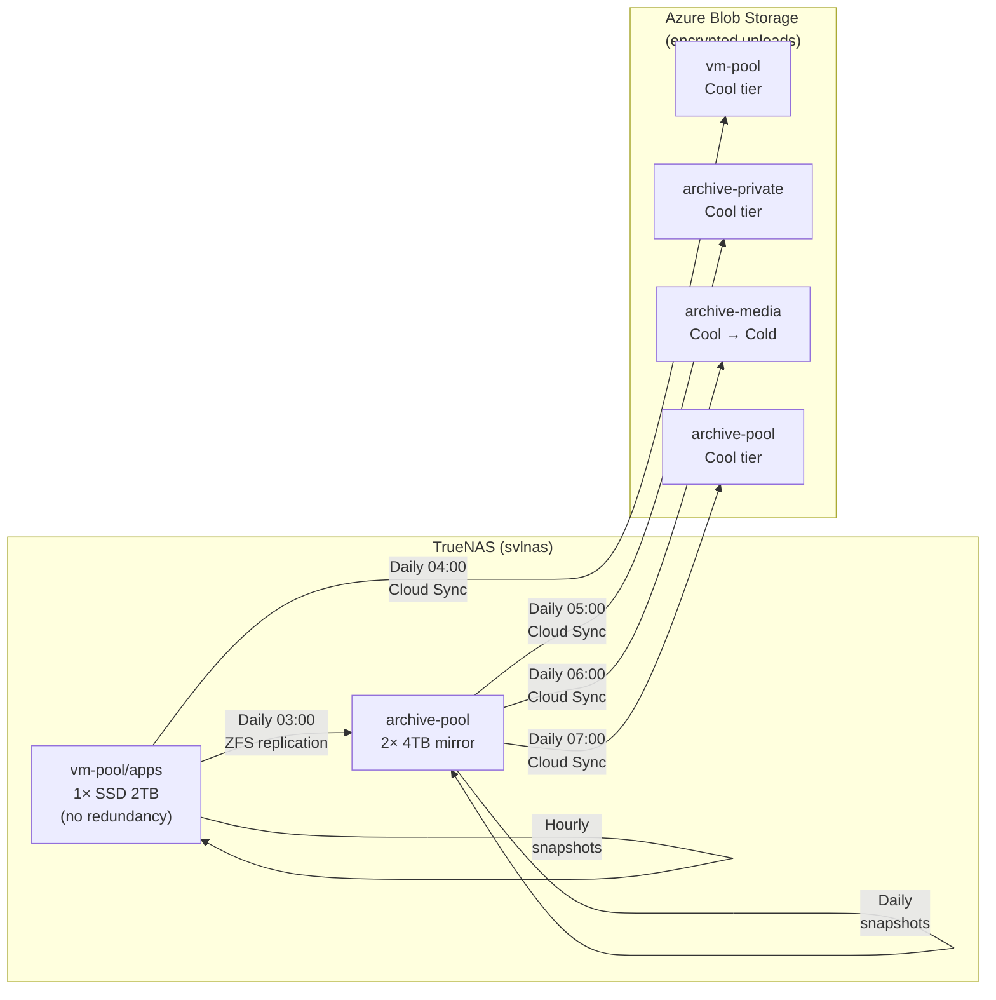

# Backup Strategy

This page documents the 3-2-1 backup strategy for the TrueNAS home lab: three copies of data, on two different storage media, with one copy off-site. For host-level storage layout and dataset conventions, see [Infrastructure](INFRASTRUCTURE.md). For full rebuild procedures, see [Disaster Recovery](DISASTER-RECOVERY.md).

## Risk Assessment

| Pool           | Disks                             | Redundancy                   | Risk                                                                                          | Impact                                                               |
| -------------- | --------------------------------- | ---------------------------- | --------------------------------------------------------------------------------------------- | -------------------------------------------------------------------- |
| `vm-pool`      | 1 × Samsung 970 Evo 2TB SSD       | **None**                     | Single-drive failure loses all app data, databases, secrets, and the git repo checkout        | **Critical** — all services down, data unrecoverable without backups |
| `archive-pool` | 2 × Seagate IronWolf 4TB (mirror) | Single-drive fault tolerance | Mirror degradation or double-drive failure loses media library, private photos, and documents | **High** — irreplaceable personal data at risk                       |

The vm-pool's lack of hardware redundancy makes cross-pool replication and off-site backup essential — not optional.

<!-- dprint-ignore -->
!!! danger "Known gap: TrueNAS VMs are NOT covered by off-site backup"
    ZFS VMs are stored as **zvols** (block devices), not regular files. rclone cannot
    read zvol data when traversing `/mnt/vm-pool/vms/`, so the `vm-pool-to-azure` Cloud
    Sync task silently skips the entire `vms/` directory without error.

    **What IS covered:** ZFS snapshots (Layer 1) and local replication to archive-pool
    (Layer 2) work correctly for zvols — `zfs send` includes zvol data. VMs survive an
    SSD failure but **not a total site loss (fire, theft).**

    **Current stance:** All VMs are treated as rebuildable. Any files inside a VM that
    must survive a site loss must be backed up out-of-band (e.g. copied to folders in `vm-pool/` or `archive-pool/`, which are picked up by Cloud Sync, or pushed to an external service directly from the VM).

    If a VM containing irreplaceable state is added in the future, revisit this with a VM-level backup agent.

---

## Recovery Objectives

| Metric                             | Target       | Rationale                                                                                                                                                              |
| ---------------------------------- | ------------ | ---------------------------------------------------------------------------------------------------------------------------------------------------------------------- |
| **RPO** (Recovery Point Objective) | **24 hours** | Daily backups are sufficient for a home lab. Hourly snapshots on vm-pool provide finer granularity for local rollback.                                                 |
| **RTO** (Recovery Time Objective)  | **≤ 1 week** | DNS runs also on a separate Azure VM (svlazext), so core network services survive a NAS failure. Full app stack rebuild can be done over several days without urgency. |

**What these targets mean in practice:**

- A vm-pool SSD failure loses at most 24 hours of data (last replication to archive-pool).
- A total site loss (fire/theft) loses at most 24 hours of data across all categories (app data, private photos, and media).
- Full rebuild from Azure Blob takes up to a week due to download bandwidth and the manual TrueNAS setup steps in [Disaster Recovery](DISASTER-RECOVERY.md).

---

## Architecture Overview



| Copy                  | Location                               | Protects against                 |
| --------------------- | -------------------------------------- | -------------------------------- |
| **1 — Original**      | vm-pool (SSD) or archive-pool (mirror) | —                                |
| **2 — Local replica** | archive-pool/replication (mirror)      | SSD failure, accidental deletion |
| **3 — Off-site**      | Azure Blob Storage (encrypted)         | Fire, theft, flood, ransomware   |

<!-- TODO: [backup] Add a second off-site destination using Restic to a separate cloud provider tech & provider diversification -->

---

## TrueNAS Host Backup

The backup layers below protect pool data, but the TrueNAS system configuration itself (users, groups, network settings, cron jobs, Cloud Sync credentials, SMART/scrub schedules) also needs to be backed up.

### System Configuration File

Export the TrueNAS config after initial setup and after every significant change:

1. Go to **System → General Settings → Manage Configuration → Download File**
2. Enable **Export Password Secret Seed** (required to restore on a different boot device)
3. Upload the downloaded `.tar` file to your online password manager, then **delete the local copy** (including from trash) — it contains sensitive credentials

Also save an initial **system debug file** (~6 MB `.tgz`) via **System → Advanced Settings → Save Debug** as a baseline reference. Upload it to the same password manager entry.

To include the config file in automated off-site backups, save it into the git repo tree (e.g. `/mnt/vm-pool/apps/truenas-config/`) so it gets picked up by the `vm-pool` Cloud Sync task. The file is client-side encrypted before upload.

### Boot Environments

Before major TrueNAS upgrades, create a boot environment (System → Boot → clone the current BE) as an OS-level rollback point. TrueNAS creates one automatically on upgrade, but a manual pre-upgrade snapshot is a safety net if the automatic one fails.

---

<!-- TODO: [backup] Evaluate pull-based off-site backup where a second ZFS host initiates replication -->

## Layer 1: ZFS Periodic Snapshots

Snapshots provide instant, zero-cost local rollback. They protect against accidental deletion, bad upgrades, application-level corruption, and ransomware. Snapshots are **read-only** — a compromised application or malware process cannot modify or delete them. Only a root/admin ZFS user can destroy snapshots, which is why off-site backup (Layer 3) remains essential. Snapshots do **not** protect against drive failure.

### Configuration

Create these tasks in TrueNAS → Data Protection → Periodic Snapshot Tasks. Use naming schema `auto-%Y-%m-%d_%H-%M` (TrueNAS default) and **Allow Empty Snapshots: Yes** on every task. Click **Run Now** (▶) on each task after creating it to take an initial snapshot and verify the task works — then confirm the snapshots appeared in Storage → Snapshots.

When multiple tasks fire at the same minute (e.g. daily + weekly both at midnight Sunday), TrueNAS creates one snapshot and assigns it the longest lifetime — no duplicates.

**vm-pool** — 4 tasks, Recursive: Yes, Exclude: _(none)_

| # | Schedule | Lifetime | Effective retention | Expected "Frequency" in TrueNAS UI |
| - | -------- | -------- | ------------------- | ---------------------------------- |
| 1 | Hourly   | 1 day    | 24 rolling hourlies | Every hour, every day              |
| 2 | Daily    | 1 month  | 30 rolling dailies  | At 00:00, every day                |
| 3 | Weekly   | 1 month  | 4 rolling weeklies  | At 00:00, only on Sunday           |
| 4 | Monthly  | 3 months | 3 rolling monthlies | At 00:00, on day 1 of the month    |

**archive-pool** — 3 tasks, Recursive: Yes, Exclude: `archive-pool/replication`

| # | Schedule | Lifetime | Effective retention | Expected "Frequency" in TrueNAS UI |
| - | -------- | -------- | ------------------- | ---------------------------------- |
| 5 | Daily    | 1 month  | 30 rolling dailies  | At 00:00, every day                |
| 6 | Weekly   | 2 months | 8 rolling weeklies  | At 00:00, only on Sunday           |
| 7 | Monthly  | 3 months | 3 rolling monthlies | At 00:00, on day 1 of the month    |

Snapshots are set at the **pool level** so all datasets (`vm-pool/apps`, `vm-pool/vms`, `vm-pool/homes`, `vm-pool/iso`, etc.) are covered automatically — including any datasets added in the future.

> **Exclude replication datasets**: The archive-pool tasks **must** exclude `archive-pool/replication` (and its children). Snapshotting a replication target creates namespace collisions that can break subsequent replication runs — the replication task expects to manage snapshots on its target exclusively.

### Cleaning Up Old Snapshots

When you delete a Periodic Snapshot Task, TrueNAS stops creating new snapshots but does **not** delete existing ones — they become unmanaged orphans that persist indefinitely. If you deleted previous tasks and want a clean slate before the new tasks take over:

```sh
# Review existing snapshots first
zfs list -t snapshot -r vm-pool
zfs list -t snapshot -r archive-pool

# Bulk-destroy all auto-* snapshots (DESTRUCTIVE — review the list above first)
zfs list -t snapshot -r -H -o name vm-pool | grep '@auto-' | xargs -n1 zfs destroy
zfs list -t snapshot -r -H -o name archive-pool | grep '@auto-' | xargs -n1 zfs destroy
```

Similarly, any replicated datasets from deleted Replication Tasks persist and must be destroyed manually before creating the new replication task.

### Selective File Restore

Snapshots are browsable as read-only directories:

```sh
# List available snapshots for a dataset
ls /mnt/vm-pool/apps/.zfs/snapshot/

# Copy a single file from a snapshot (no rollback needed)
cp /mnt/vm-pool/apps/.zfs/snapshot/auto-2026-04-11_03-00/services/outline/data/db/PG_VERSION ./restored-file

# Browse a specific app's snapshot
ls /mnt/vm-pool/apps/services/immich/.zfs/snapshot/
```

Child datasets have their own independent snapshot timelines (accessible via `.zfs/snapshot/` within each dataset mountpoint), so you can restore one app without affecting others.

---

## Layer 2: Local Cross-Pool Replication

Replication copies vm-pool snapshots to the mirrored archive-pool, providing hardware redundancy for the single-SSD vm-pool. This is the **highest-priority** backup layer.

### Configuration

1. Create the **parent container** dataset in TrueNAS → Datasets → Add Dataset. The replication task will create the child (`vm-pool`) automatically on first run — do not pre-create it.

   | Setting            | Value                                                                                  |
   | ------------------ | -------------------------------------------------------------------------------------- |
   | Parent             | `archive-pool`                                                                         |
   | Name               | `replication`                                                                          |
   | Dataset Preset     | Generic                                                                                |
   | Compression        | Inherit (LZ4 from archive-pool — adequate for a container dataset)                     |
   | Enable Atime       | Off                                                                                    |
   | Snapshot Directory | `--` (Inherit — resolves to Invisible; `.zfs` accessible by path but hidden from `ls`) |
   | ACL Type           | Off (plain Unix permissions; safe — does not propagate to replicated child datasets)   |
   | ACL Mode           | Discard                                                                                |
   | Exec               | Off                                                                                    |
   | Encryption         | **None** — do not encrypt the container. The replicated child receives its encryption  |
   |                    | state from the replication stream (`vm-pool/apps` is ZFS-encrypted, so the replica     |
   |                    | arrives encrypted automatically)                                                       |

2. Create a Replication Task in TrueNAS → Data Protection → Replication Tasks (use Advanced mode):

   | Setting                                    | Value                                                                                                                                       |
   | ------------------------------------------ | ------------------------------------------------------------------------------------------------------------------------------------------- |
   | Name                                       | `vm-pool → archive-pool`                                                                                                                    |
   | Transport                                  | LOCAL                                                                                                                                       |
   | Allow Blocks Larger than 128KB             | Yes — improves throughput for large datasets                                                                                                |
   | Allow Compressed WRITE Records             | Yes — sends blocks pre-compressed, faster and lower CPU                                                                                     |
   | Source                                     | `vm-pool`                                                                                                                                   |
   | Recursive                                  | Yes                                                                                                                                         |
   | Include Dataset Properties                 | Yes — replicates compression, atime, etc.                                                                                                   |
   | Full Filesystem Replication                | No                                                                                                                                          |
   | Periodic Snapshot Tasks                    | Select all 4 vm-pool snapshot tasks                                                                                                         |
   | Only Replicate Snapshots Matching Schedule | No — replicates all snapshots from all 4 tasks (hourly, daily, weekly, monthly); enabling this would skip all but the 03:00 daily snapshots |
   | Save Pending Snapshots                     | No                                                                                                                                          |
   | Destination                                | `archive-pool/replication/vm-pool` (created automatically on first run)                                                                     |
   | Destination Dataset Read-only              | REQUIRE — prevents accidental writes to the replica                                                                                         |
   | Encryption                                 | No — source encryption is carried in the replication stream automatically                                                                   |
   | Replication from scratch                   | No                                                                                                                                          |
   | Snapshot Retention Policy                  | Same as Source — replica prunes in sync with source task lifetimes                                                                          |
   | Run Automatically                          | Yes                                                                                                                                         |
   | Schedule                                   | Daily at 03:00                                                                                                                              |

   Replication is strictly one-way: vm-pool → archive-pool/replication/vm-pool. The archive-pool snapshot tasks snapshot archive-pool's own datasets (private, content) independently — none of that flows through this task.

3. Run the task manually once to complete the initial full replication (this may take a while on first run). Subsequent runs are incremental (only changed blocks).

### Restore from Replica

If vm-pool fails:

1. Replace the failed SSD and create a new `vm-pool` pool
2. Create the `vm-pool/apps` dataset (with encryption — see [Disaster Recovery § Step 1](DISASTER-RECOVERY.md#step-1-create-zfs-datasets))
3. Create a one-time Replication Task in reverse: `archive-pool/replication/vm-pool` → `vm-pool`
4. Continue with [Disaster Recovery § Step 2](DISASTER-RECOVERY.md#step-2-create-users-and-groups) onward

---

## Layer 3: Off-Site — Azure Blob Cloud Sync

Cloud Sync tasks upload encrypted copies to Azure Blob Storage, providing geographic disaster recovery (fire, theft, flood).

### Azure Storage Account Setup

Create a **new** Storage Account (e.g. `truenasbackupsprod`). Version-level immutability **must be enabled at account creation** — it cannot be added to an existing account.

**Basics tab:**

| Setting          | Value                                                                                                                      |
| ---------------- | -------------------------------------------------------------------------------------------------------------------------- |
| Storage type     | Azure Blob Storage or Azure Data Lake Storage Gen 2                                                                        |
| Primary workload | Backup & Archive                                                                                                           |
| Performance      | Standard                                                                                                                   |
| Redundancy       | LRS (locally redundant — cost-effective for backup; RA-GRS adds cost for no benefit since ZFS replication is the HA layer) |

**Advanced tab:**

| Setting                             | Value                                                              |
| ----------------------------------- | ------------------------------------------------------------------ |
| Storage account key access          | Enabled (required — TrueNAS Cloud Sync only supports account keys) |
| Permitted scope for copy operations | From storage accounts in the same Microsoft Entra tenant           |
| Access tier                         | Cool                                                               |

**Networking tab:**

| Setting               | Value                                                                                   |
| --------------------- | --------------------------------------------------------------------------------------- |
| Public network access | Enabled from selected virtual networks and IP addresses                                 |
| IP allowlist          | Add the external IP of your home network (shared by both client and TrueNAS behind NAT) |
| Routing preference    | Microsoft network routing                                                               |

> **Dynamic IP risk**: Home ISPs typically assign dynamic IPs. If your external IP changes, Cloud Sync will fail with 403 errors. Update the firewall allowlist when your IP changes, or switch to "Enable from all networks" if this becomes a maintenance burden (still protected by account key + blob versioning + soft delete).

**Data Protection tab:**

| Setting                              | Value                                                                                                                                                                                 |
| ------------------------------------ | ------------------------------------------------------------------------------------------------------------------------------------------------------------------------------------- |
| Point-in-time restore for containers | **Disabled** — incompatible with version-level immutability                                                                                                                           |
| Soft delete for blobs                | Enabled — 14 days                                                                                                                                                                     |
| Soft delete for containers           | Enabled — 7 days                                                                                                                                                                      |
| Soft delete for file shares          | Enabled — 7 days (not used, but harmless)                                                                                                                                             |
| Enable versioning for blobs          | Enabled                                                                                                                                                                               |
| Enable blob change feed              | Enabled, keep all logs (audit trail of all create/modify/deletes)                                                                                                                     |
| Enable version-level immutability    | **Enabled** (Access control section) — enables WORM capability per container; no container policies are currently active (see [Step 2](#step-2--worm-retention-policies-not-applied)) |

**Encryption tab:**

| Setting                   | Value                                                                  |
| ------------------------- | ---------------------------------------------------------------------- |
| Encryption key management | Microsoft-managed keys                                                 |
| Infrastructure encryption | Enabled (double encryption at infrastructure layer — defense-in-depth) |

> **Important**: Version-level immutability (the account-level WORM capability) cannot be disabled once enabled. No container-level retention policies are currently configured — see [Step 2](#step-2--worm-retention-policies-not-applied) for the reasoning.

#### Step 1 — Create Four Containers

For each container, use Azure Portal → Storage Account → Data Storage → Containers → **+ Container**:

| Container         | Anonymous access level | Notes                                                        |
| ----------------- | ---------------------- | ------------------------------------------------------------ |
| `vm-pool`         | Private                | Apps, VMs, db dumps, secrets, config (whole pool)            |
| `archive-pool`    | Private                | Catch-all: docs, config — excl. replication/media/private/dl |
| `archive-private` | Private                | Immich photos, private documents                             |
| `archive-media`   | Private                | Media library (movies, music, TV, YouTube)                   |

Settings per container:

- **Anonymous access level**: Private (disabled at account level)
- **Encryption scope**: leave empty (uses the account default)
- **Enable version-level immutability support**: checked (inherited from account, cannot be unchecked)

#### Step 2 — WORM Retention Policies (Not Applied)

No container-level time-based retention policies are configured on any container.

**Why:** rclone (used by TrueNAS Cloud Sync) issues hard delete calls when propagating deletions in SYNC mode. Azure rejects these calls with a 409/412 error when a WORM policy is active — even if the deletion is intentional and the credential is valid. This causes the Cloud Sync task to fail every night for every file deleted from the NAS within the WORM retention window. There is no rclone flag to ignore only WORM-blocked deletes; `--ignore-errors` suppresses all errors, which masks real failures.

Policies were added initially (30 days on `vm-pool`, 90 days on `archive-private`) and removed on 2026-04-13 after observing the first run errors.

The account-level version-level immutability capability remains enabled — this is permanent and cannot be undone. If a WORM-compatible backup tool is adopted in the future (e.g. Restic, which uses an append-only model and never issues deletes during a backup run), per-container policies can be re-added at that time.

For now, ransomware protection relies on blob versioning, 14-day soft delete, and the resource lock. See [Azure-Side Ransomware Protection](#azure-side-ransomware-protection).

#### Step 3 — Verify Blob and Container Soft Delete

Blob soft delete (14 days) and container soft delete (7 days) were already configured during [storage account creation](#azure-storage-account-setup) on the Data Protection tab. Verify the settings are active:

Azure Portal → Storage Account → Data management → **Data protection** → under **Recovery**:

| Setting                           | Expected value |
| --------------------------------- | -------------- |
| Enable soft delete for blobs      | Enabled        |
| Days to retain deleted blobs      | **14**         |
| Enable soft delete for containers | Enabled        |
| Days to retain deleted containers | **7**          |

These are account-level settings — they apply to all containers equally.

#### Step 4 — Lifecycle Management for `archive-media`

Navigate to Storage Account → Data Management → **Lifecycle management** → switch to **Code view** and paste the following policy JSON:

```json
{
  "rules": [
    {
      "name": "archive-media-tier-to-cold",
      "enabled": true,
      "type": "Lifecycle",
      "definition": {
        "actions": {
          "baseBlob": {
            "tierToCold": {
              "daysAfterModificationGreaterThan": 7
            }
          }
        },
        "filters": {
          "blobTypes": ["blockBlob"],
          "prefixMatch": ["archive-media/"]
        }
      }
    },
    {
      "name": "archive-media-delete-old-versions",
      "enabled": true,
      "type": "Lifecycle",
      "definition": {
        "actions": {
          "version": {
            "delete": {
              "daysAfterCreationGreaterThan": 7
            }
          }
        },
        "filters": {
          "blobTypes": ["blockBlob"],
          "prefixMatch": ["archive-media/"]
        }
      }
    }
  ]
}
```

Two rules in this policy:

| Rule                                | What it does                          | Condition                                                                                              |
| ----------------------------------- | ------------------------------------- | ------------------------------------------------------------------------------------------------------ |
| `archive-media-tier-to-cold`        | Cool → Cold after 7 days              | Still online (ms access, no rehydration), ~half the cost of Cool                                       |
| `archive-media-delete-old-versions` | Delete previous versions after 7 days | Blob versioning is mandatory (account-level) but media doesn't need version history — keeps costs flat |

Archive tier is not used — at current data volumes (< 4 TB) the savings over Cold (~$10/month) don't justify the 180-day minimum retention and hours-long rehydration delay. This can be revisited if media grows significantly.

#### Step 5 — Create Cloud Credential

Create a Cloud Credential in TrueNAS → Credentials → Cloud Credentials using a **Storage Account access key**. TrueNAS Cloud Sync only supports account keys for Azure Blob Storage.

Account keys are data-plane credentials — they grant full read/write/delete access to blob data (including blob versions), but they **cannot** modify storage account settings (management plane). This means a compromised key cannot disable versioning, remove resource locks, or delete the account. The gap — that account keys _can_ delete individual blob versions — is closed by version-level immutability (WORM retention policies). See [Azure-Side Ransomware Protection](#azure-side-ransomware-protection).

### Cloud Sync Tasks

Create these tasks in TrueNAS → Data Protection → Cloud Sync Tasks → **Add**. Switch to **Advanced** mode. All four tasks share the same credential, encryption settings, and advanced options — only the fields listed per task differ.

#### Task A — `vm-pool-to-azure`

**Transfer:**

| Field           | Value              |
| --------------- | ------------------ |
| Description     | `vm-pool-to-azure` |
| Direction       | PUSH               |
| Transfer Mode   | SYNC               |
| Directory/Files | `/mnt/vm-pool`     |

**Remote:**

| Field      | Value                                  |
| ---------- | -------------------------------------- |
| Credential | _(your Azure Blob Storage credential)_ |
| Container  | `vm-pool`                              |
| Folder     | `/`                                    |

**Control:**

| Field    | Value               |
| -------- | ------------------- |
| Schedule | Custom: `0 4 * * *` |
| Enabled  | Yes                 |

**Advanced Options:**

| Field                                   | Value            |
| --------------------------------------- | ---------------- |
| Use Snapshot                            | No               |
| Create empty source dirs on destination | No               |
| Follow Symlinks                         | No               |
| Pre-script                              | _(empty)_        |
| Post-script                             | _(empty)_        |
| Exclude                                 | `iso/` ↵ `.zfs/` |

**Advanced Remote Options:**

| Field               | Value                     |
| ------------------- | ------------------------- |
| Use --fast-list     | No                        |
| Remote Encryption   | Yes                       |
| Filename Encryption | No                        |
| Encryption Password | _(from password manager)_ |
| Encryption Salt     | _(from password manager)_ |
| Transfers           | Low Bandwidth (4)         |
| Bandwidth Limit     | _(empty)_                 |

Covers the entire `vm-pool` pool: apps, VMs, db dumps, secrets, git repo. `iso/` excluded — installer images have no restore value. All content is client-side encrypted before upload. Schedule is after the 03:00 replication and db-backup sidecars.

---

#### Task B — `archive-private-to-azure`

**Transfer:**

| Field           | Value                       |
| --------------- | --------------------------- |
| Description     | `archive-private-to-azure`  |
| Direction       | PUSH                        |
| Transfer Mode   | SYNC                        |
| Directory/Files | `/mnt/archive-pool/private` |

**Remote:**

| Field      | Value                                  |
| ---------- | -------------------------------------- |
| Credential | _(your Azure Blob Storage credential)_ |
| Container  | `archive-private`                      |
| Folder     | `/`                                    |

**Control:**

| Field    | Value               |
| -------- | ------------------- |
| Schedule | Custom: `0 5 * * *` |
| Enabled  | Yes                 |

**Advanced Options:**

| Field                                   | Value     |
| --------------------------------------- | --------- |
| Use Snapshot                            | No        |
| Create empty source dirs on destination | No        |
| Follow Symlinks                         | No        |
| Pre-script                              | _(empty)_ |
| Post-script                             | _(empty)_ |
| Exclude                                 | `.zfs/`   |

**Advanced Remote Options:** _(same as Task A)_

Immich photos and private documents. Highest WORM retention (90 days) — irreplaceable personal data.

---

#### Task C — `archive-media-to-azure`

**Transfer:**

| Field           | Value                             |
| --------------- | --------------------------------- |
| Description     | `archive-media-to-azure`          |
| Direction       | PUSH                              |
| Transfer Mode   | SYNC                              |
| Directory/Files | `/mnt/archive-pool/content/media` |

**Remote:**

| Field      | Value                                  |
| ---------- | -------------------------------------- |
| Credential | _(your Azure Blob Storage credential)_ |
| Container  | `archive-media`                        |
| Folder     | `/`                                    |

**Control:**

| Field    | Value               |
| -------- | ------------------- |
| Schedule | Custom: `0 6 * * *` |
| Enabled  | Yes                 |

**Advanced Options:**

| Field                                   | Value     |
| --------------------------------------- | --------- |
| Use Snapshot                            | No        |
| Create empty source dirs on destination | No        |
| Follow Symlinks                         | No        |
| Pre-script                              | _(empty)_ |
| Post-script                             | _(empty)_ |
| Exclude                                 | `.zfs/`   |

**Advanced Remote Options:** _(same as Task A)_

Full media library. No WORM retention — old versions cleaned up by lifecycle rule after 7 days. Lifecycle policy moves blobs to Cold tier after 7 days. `downloads/` is not under `media/` so it's excluded by path scope.

---

#### Task D — `archive-pool-to-azure`

**Transfer:**

| Field           | Value                   |
| --------------- | ----------------------- |
| Description     | `archive-pool-to-azure` |
| Direction       | PUSH                    |
| Transfer Mode   | SYNC                    |
| Directory/Files | `/mnt/archive-pool`     |

**Remote:**

| Field      | Value                                  |
| ---------- | -------------------------------------- |
| Credential | _(your Azure Blob Storage credential)_ |
| Container  | `archive-pool`                         |
| Folder     | `/`                                    |

**Control:**

| Field    | Value               |
| -------- | ------------------- |
| Schedule | Custom: `0 7 * * *` |
| Enabled  | Yes                 |

**Advanced Options:**

| Field                                   | Value                                                                                            |
| --------------------------------------- | ------------------------------------------------------------------------------------------------ |
| Use Snapshot                            | No                                                                                               |
| Create empty source dirs on destination | No                                                                                               |
| Follow Symlinks                         | No                                                                                               |
| Pre-script                              | _(empty)_                                                                                        |
| Post-script                             | _(empty)_                                                                                        |
| Exclude                                 | `replication/` ↵ `content/media/` ↵ `private/` ↵ `content/downloads/` ↵ `TimeMachine/` ↵ `.zfs/` |

**Advanced Remote Options:** _(same as Task A)_

Catch-all for everything on `archive-pool` not captured by Tasks B and C. Excludes: `replication/` (ZFS replication target), `content/media/` (Task C), `private/` (Task B), `content/downloads/` (transient), `TimeMachine/` (already a Mac backup). No WORM retention — blob versioning + soft delete provide sufficient protection.

---

#### Cloud Sync Notes

**Exclude trailing slashes**: Every exclude entry must end with `/` (e.g. `.zfs/`, not `.zfs`). In rclone, the trailing slash marks it as a directory filter — without it, rclone may still recurse into the directory. The ↵ symbol above means press Enter between each exclude entry in the TrueNAS UI.

**Encryption**: Use the same password and salt across all four tasks (simpler key management) or unique ones per task (stronger isolation). **Store the password and salt in your password manager** — without them, encrypted blobs cannot be restored. Leave **Filename Encryption** deselected — plaintext filenames allow browsing and verifying backups in Azure Portal with no security downside (content is still fully encrypted).

**Use Snapshot**: Disabled on all tasks. TrueNAS only supports this on leaf datasets with no child datasets. Pool-level paths have nested children, producing the error _"This option is only available for datasets that have no further nesting."_ The consistency risk is minimal — db-backup sidecars produce application-consistent dumps before Cloud Sync runs, and media/config files are rarely written mid-sync.

**Exclusions**: `archive-pool/content/downloads/` and `archive-pool/TimeMachine/` are excluded — transient downloads have no backup value, and Time Machine backups are already a redundant copy of a Mac.

**Notifications**: Enable email notifications on task failure for all four tasks.

### Azure-Side Ransomware Protection

Blob versioning and soft delete protect against accidents, but a compromised account key could delete individual blob versions, removing the recovery points. Two hardening layers close this gap:

<!-- dprint-ignore -->
!!! warning "No WORM retention policies are active"
    Container-level time-based retention policies were intentionally removed because
    rclone SYNC mode issues hard deletes that Azure rejects when WORM is active, causing
    nightly task failures for every file deleted from the NAS. See
    [Step 2](#step-2--worm-retention-policies-not-applied) for full context.

    WORM-based immutability will be reconsidered when a WORM-compatible backup tool
    (such as Restic) is adopted — see [issue #154](https://github.com/DevSecNinja/truenas-apps/issues/154).

**1. Blob versioning + soft delete**

Blob versioning is enabled at the account level. Every overwrite creates a new current version; the previous version is retained for 14 days by soft delete. A compromised account key can delete the current version, but it becomes a soft-deleted previous version — still recoverable from Azure Portal or via API within the retention window.

How this protects against ransomware:

- Ransomware encrypts all NAS files → Cloud Sync uploads the encrypted versions as new current versions → the pre-encryption versions become soft-deleted previous versions → recoverable for 14 days
- A compromised account key cannot disable versioning or extend the soft delete window (management-plane operations)

The 14-day window is shorter than a WORM policy would provide. This is an accepted trade-off until a WORM-compatible backup tool is in place.

**2. Resource lock on the Storage Account**

In Azure Portal → Storage Account → Settings → Locks, create:

| Setting   | Value               |
| --------- | ------------------- |
| Lock name | `backup-protection` |
| Lock type | Delete              |

The lock prevents deletion of the storage account and its containers — even by users with Owner role. It must be manually removed before any destructive operation, adding a deliberate step that automated ransomware cannot perform. Account keys (data-plane) cannot remove locks (management-plane).

**Note on container soft delete**

Container soft delete (7 days) was already configured during [storage account creation](#azure-storage-account-setup) and verified in [Step 3](#step-3--verify-blob-and-container-soft-delete). This recovers an entire container if it is deleted — separate from blob-level soft delete.

**Recovery after a ransomware event:**

1. Identify the last clean version timestamp (before encryption date)
2. In Azure Portal, browse blob versions for the affected container
3. For each blob, select the last clean version → **Make current version**
4. Or use rclone/Cloud Sync Pull filtered by version timestamp to bulk-restore

### Restore from Azure Blob

1. Create a Cloud Sync task in **Pull** direction pointing at the desired Azure container
2. Set a local destination path (e.g. `/mnt/vm-pool/apps-restore/` or the final dataset directly)
3. Enable encryption with the same passphrase and salt used during upload
4. Run the task — TrueNAS decrypts blobs during download

For selective restore, use the **rclone** CLI directly on the TrueNAS host:

```sh
# List files in the encrypted remote (decrypted view)
rclone ls azure-crypt:vm-pool/apps/services/outline/backups/

# Copy a single directory
rclone copy azure-crypt:vm-pool/apps/services/outline/backups/ /mnt/vm-pool/apps/services/outline/backups/
```

This requires configuring an rclone remote with the crypt wrapper and appropriate credentials. See the [rclone crypt documentation](https://rclone.org/crypt/).

For the `archive-media` container, blobs move from Cool to Cold tier after 7 days via lifecycle policy. Cold tier is still online — blobs can be downloaded directly without rehydration, just like Cool tier blobs.

---

## Application-Level Database Backups

All four stateful databases have `tiredofit/db-backup` sidecars in their compose files. These produce compressed, encrypted dump files independent of ZFS snapshots — providing an application-consistent recovery point that a raw filesystem snapshot may not guarantee (especially for PostgreSQL WAL consistency).

### Covered Databases

| Service | Database   | Backup sidecar      | Output path                           |
| ------- | ---------- | ------------------- | ------------------------------------- |
| Gatus   | PostgreSQL | `gatus-db-backup`   | `services/gatus/backups/db-backup/`   |
| Immich  | PostgreSQL | `immich-db-backup`  | `services/immich/backups/db-backup/`  |
| Outline | PostgreSQL | `outline-db-backup` | `services/outline/backups/db-backup/` |
| Unifi   | MongoDB    | `unifi-db-backup`   | `services/unifi/backups/db-backup/`   |

### How They Run

All db-backup sidecars use `MODE=MANUAL` + `MANUAL_RUN_FOREVER=FALSE` — they run one backup and exit. The `dccd.sh` CD script restarts them on each deploy cycle (every 15 minutes via cron). Dumps are:

- Compressed with zstd
- Encrypted with `DB_ENC_PASSPHRASE` (from each app's `secret.sops.env`)
- Retained for 48 hours locally (`DEFAULT_CLEANUP_TIME=2880`)
- Email notifications sent on success/failure

### Restore a Database Dump

1. Locate the dump file (locally or download from Azure Blob — see [Layer 3 restore](#restore-from-azure-blob)):

   ```sh
   ls services/immich/backups/db-backup/
   ```

2. Decrypt and decompress:

   ```sh
   # tiredofit/db-backup encrypts with GPG symmetric passphrase encryption
   gpg --batch --passphrase "<DB_ENC_PASSPHRASE>" \
     --output pgsql_immich_immich_20260411-020000.sql.zst \
     --decrypt pgsql_immich_immich_20260411-020000.sql.zst.gpg

   zstd -d pgsql_immich_immich_20260411-020000.sql.zst
   ```

3. Restore into a running PostgreSQL container:

   ```sh
   # Copy the plain-text SQL dump into the container
   docker cp pgsql_immich_immich_20260411-020000.sql immich-db:/tmp/

   # Restore with psql (tiredofit/db-backup produces plain-text pg_dump output)
   docker exec -it -e PGPASSWORD='<password>' immich-db psql \
     -U immich -d immich -f /tmp/pgsql_immich_immich_20260411-020000.sql
   ```

   For MongoDB (Unifi):

   ```sh
   docker exec -it unifi-db mongorestore \
     --uri="mongodb://root:<password>@localhost:27017" \
     --authenticationDatabase=admin \
     --gzip --drop /tmp/unifi-dump/
   ```

---

## Secrets Inventory

These credentials must be stored securely outside the NAS (password manager) to enable full disaster recovery:

| Secret                                | Purpose                              | Used by                            |
| ------------------------------------- | ------------------------------------ | ---------------------------------- |
| Age private key (`age.key`)           | Decrypts all `secret.sops.env` files | SOPS / `dccd.sh`                   |
| Cloud Sync encryption password + salt | Decrypts Azure Blob backups          | rclone crypt / TrueNAS Cloud Sync  |
| `DB_ENC_PASSPHRASE`                   | Decrypts database dump files         | `tiredofit/db-backup`              |
| Azure Storage credential              | Authenticates to Azure Blob          | TrueNAS Cloud Sync tasks           |
| ZFS encryption passphrase             | Unlocks `vm-pool/apps` dataset       | TrueNAS (on boot or manual unlock) |
| TrueNAS system config (`.tar` file)   | Restores TrueNAS host configuration  | TrueNAS System → Manage Config     |

All secrets are stored in an **online password manager** (cloud-synced), ensuring they remain accessible during a total site loss — even if the NAS, local network, and all on-premises devices are unavailable. The password manager is accessible from any device with internet access (phone, borrowed laptop, etc.), breaking the circular dependency where encrypted backups require keys stored on the same hardware that failed.

---

## Disk Health: Scrub Tasks & SMART Tests

Backups protect against data loss, but proactive disk health monitoring prevents failures from happening silently. TrueNAS provides two complementary mechanisms.

### ZFS Scrub Tasks

A scrub reads every block on a pool, verifies checksums, and repairs any corruption from the redundant copy (mirror/RAIDZ). Without regular scrubs, bit rot can silently corrupt data — and on a non-redundant pool like vm-pool, a scrub at least detects corruption early so you can restore from backup before more damage accumulates.

Create these tasks in TrueNAS → Data Protection → Scrub Tasks:

| Pool           | Schedule                | Threshold (days) | Notes                                                    |
| -------------- | ----------------------- | ---------------- | -------------------------------------------------------- |
| `vm-pool`      | Monthly (1st Sun 02:00) | 35               | No mirror — scrub detects but cannot self-heal           |
| `archive-pool` | Monthly (1st Sun 02:00) | 35               | Mirror — scrub detects and auto-repairs from mirror copy |

TrueNAS creates default scrub tasks for each pool on creation. Verify they exist and are scheduled monthly.

**After a scrub completes**, check the pool status:

```sh
zpool status vm-pool
zpool status archive-pool
```

Look for `errors: No known data errors` and zero values in the `CKSUM` column. Any checksum errors on vm-pool mean data corruption that cannot be self-healed — restore the affected files from a snapshot or replica immediately.

### S.M.A.R.T. Tests

S.M.A.R.T. tests query the drive's internal health diagnostics. A short test takes minutes and catches most impending failures. A long test reads the entire surface and can take hours.

Create these tasks in TrueNAS → Data Protection → S.M.A.R.T. Tests:

| Test type | Schedule                | Disks     |
| --------- | ----------------------- | --------- |
| Short     | Weekly (Sun 02:00)      | All disks |
| Long      | Monthly (1st Sat 01:00) | All disks |

The long test runs at 01:00 on the 1st Saturday so it finishes well before the scrub starts at 02:00 the following morning (1st Sunday). Spinning disk long tests can take 4–8+ hours; the SSD long test is typically under 30 minutes.

**Enable S.M.A.R.T. alerts** in TrueNAS → System → Alert Settings to receive email notifications when a drive reports errors or predictive failure.

After a test completes, review results:

```sh
# View latest test results for a specific disk
smartctl -l selftest /dev/sdX

# View overall health assessment
smartctl -H /dev/sdX
```

---

## Schedule Overview

All times are local to the TrueNAS host.

| Time                    | Task                                               | Type                   |
| ----------------------- | -------------------------------------------------- | ---------------------- |
| 02:00 Sun (weekly)      | S.M.A.R.T. short test (all disks)                  | Disk Health            |
| 01:00 1st Sat (monthly) | S.M.A.R.T. long test (all disks)                   | Disk Health            |
| 02:00 1st Sun (monthly) | ZFS scrub (both pools)                             | Disk Health            |
| Every hour              | vm-pool snapshot                                   | ZFS Periodic Snapshot  |
| Every day               | archive-pool snapshot                              | ZFS Periodic Snapshot  |
| 03:00 daily             | vm-pool → archive-pool replication                 | ZFS Replication        |
| 04:00 daily             | vm-pool → Azure `vm-pool`                          | Cloud Sync (encrypted) |
| 05:00 daily             | archive-pool/private → Azure `archive-private`     | Cloud Sync (encrypted) |
| 06:00 daily             | archive-pool/content/media → Azure `archive-media` | Cloud Sync (encrypted) |
| 07:00 daily             | archive-pool (catch-all) → Azure `archive-pool`    | Cloud Sync (encrypted) |
| On each `dccd.sh` run   | Database dumps (all 4 DBs)                         | `tiredofit/db-backup`  |
| 04:00 weekly (Sat)      | Automated backup/restore cycle (CI)                | GitHub Actions         |

Tasks are staggered to avoid overlapping I/O on the NAS. The weekly CI pipeline
(`backup-restore-test.yml`) is independent of the NAS — it spins up ephemeral
Docker containers and validates the full encrypt → decrypt → restore path.

---

## Verification Checklist

Run these checks after initial setup and periodically (monthly recommended):

- [ ] Replication task status shows **Success** in TrueNAS → Data Protection
- [ ] `archive-pool/replication/vm-pool` has recent snapshots: `zfs list -t snapshot -r archive-pool/replication`
- [ ] All four Cloud Sync tasks show **Success** in TrueNAS → Data Protection
- [ ] Encrypted blobs are visible in Azure Portal for each container
- [ ] Blob versioning is active on all containers (account-level setting, verify in Portal → Data Protection)
- [ ] Snapshot browse test: `ls /mnt/vm-pool/apps/.zfs/snapshot/` shows recent entries
- [ ] File restore test: copy a file from a snapshot and verify its contents
- [ ] DB restore test: automated weekly by the `backup-restore-test` CI pipeline — check the [Actions tab](https://github.com/DevSecNinja/truenas-apps/actions/workflows/backup-restore-test.yml) for the latest run status
- [ ] Azure restore test: pull one file via rclone with the crypt passphrase and verify contents
- [ ] All secrets in the [Secrets Inventory](#secrets-inventory) are present and current in your password manager
- [ ] Cloud Sync email notifications fire on simulated failure (disable network briefly, verify alert arrives)
- [ ] ZFS scrub tasks exist for both pools and last run shows no errors: `zpool status`
- [ ] S.M.A.R.T. tests are scheduled and last results show **Passed**: `smartctl -H /dev/sdX`
- [ ] S.M.A.R.T. email alerts are enabled in TrueNAS → System → Alert Settings
- [ ] TrueNAS system config file is exported and stored in password manager (re-export after config changes)
- [ ] Boot environment exists as a pre-upgrade rollback point
- [ ] Version-level immutability is enabled on the Azure Storage Account (cannot be changed after creation)
- [ ] WORM retention policies are set: `vm-pool` (30 days), `archive-private` (90 days), `archive-pool` and `archive-media` (none)
- [ ] Resource lock (`Delete`) exists on the Azure Storage Account: Portal → Locks
- [ ] Container soft delete is enabled on the Azure Storage Account (≥ 7 days)
- [ ] Account key is rotated periodically (Portal → Security + networking → Access keys)
