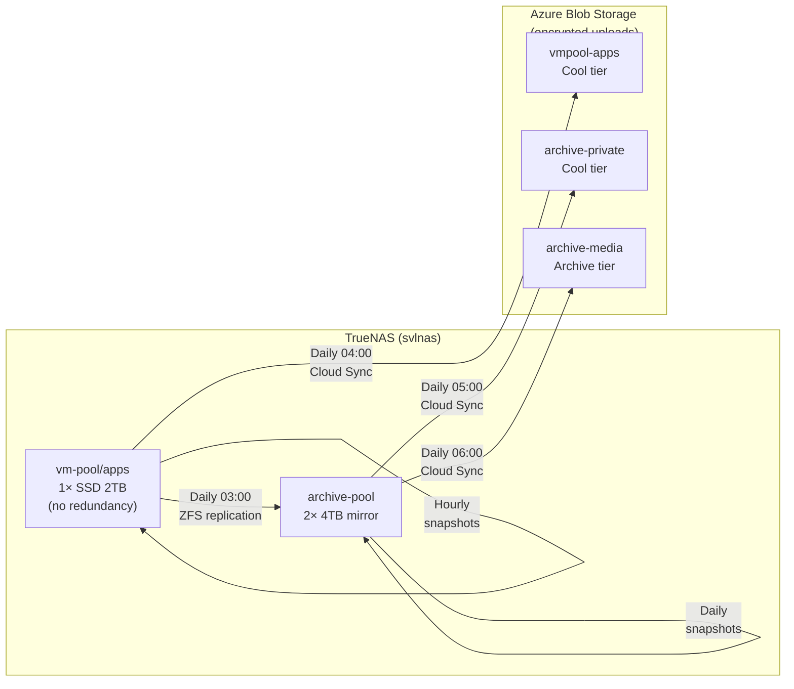

# Backup Strategy

This page documents the 3-2-1 backup strategy for the TrueNAS home lab: three copies of data, on two different storage media, with one copy off-site. For host-level storage layout and dataset conventions, see [Infrastructure](INFRASTRUCTURE.md). For full rebuild procedures, see [Disaster Recovery](DISASTER-RECOVERY.md).

## Risk Assessment

| Pool           | Disks                             | Redundancy                   | Risk                                                                                          | Impact                                                               |
| -------------- | --------------------------------- | ---------------------------- | --------------------------------------------------------------------------------------------- | -------------------------------------------------------------------- |
| `vm-pool`      | 1 × Samsung 970 Evo 2TB SSD       | **None**                     | Single-drive failure loses all app data, databases, secrets, and the git repo checkout        | **Critical** — all services down, data unrecoverable without backups |
| `archive-pool` | 2 × Seagate IronWolf 4TB (mirror) | Single-drive fault tolerance | Mirror degradation or double-drive failure loses media library, private photos, and documents | **High** — irreplaceable personal data at risk                       |

The vm-pool's lack of hardware redundancy makes cross-pool replication and off-site backup essential — not optional.

---

## Recovery Objectives

| Metric                             | Target       | Rationale                                                                                                                                                              |
| ---------------------------------- | ------------ | ---------------------------------------------------------------------------------------------------------------------------------------------------------------------- |
| **RPO** (Recovery Point Objective) | **24 hours** | Daily backups are sufficient for a home lab. Hourly snapshots on vm-pool provide finer granularity for local rollback.                                                 |
| **RTO** (Recovery Time Objective)  | **≤ 1 week** | DNS runs also on a separate Azure VM (svlazext), so core network services survive a NAS failure. Full app stack rebuild can be done over several days without urgency. |

**What these targets mean in practice:**

- A vm-pool SSD failure loses at most 24 hours of data (last replication to archive-pool).
- A total site loss (fire/theft) loses at most 24 hours of data across all categories (app data, private photos, and media).
- Full rebuild from Azure Blob takes up to a week due to Archive-tier rehydration (media) and the manual TrueNAS setup steps in [Disaster Recovery](DISASTER-RECOVERY.md).

---

## Architecture Overview



| Copy                  | Location                               | Protects against                 |
| --------------------- | -------------------------------------- | -------------------------------- |
| **1 — Original**      | vm-pool (SSD) or archive-pool (mirror) | —                                |
| **2 — Local replica** | archive-pool/replication (mirror)      | SSD failure, accidental deletion |
| **3 — Off-site**      | Azure Blob Storage (encrypted)         | Fire, theft, flood, ransomware   |

<!-- TODO: [backup] Add a second off-site destination using Restic to a separate cloud provider tech & provider diversification -->

---

## TrueNAS Host Backup

The backup layers below protect pool data, but the TrueNAS system configuration itself (users, groups, network settings, cron jobs, Cloud Sync credentials, SMART/scrub schedules) also needs to be backed up.

### System Configuration File

Export the TrueNAS config after initial setup and after every significant change:

1. Go to **System → General Settings → Manage Configuration → Download File**
2. Enable **Export Password Secret Seed** (required to restore on a different boot device)
3. Upload the downloaded `.tar` file to your online password manager, then **delete the local copy** (including from trash) — it contains sensitive credentials

Also save an initial **system debug file** (~6 MB `.tgz`) via **System → Advanced Settings → Save Debug** as a baseline reference. Upload it to the same password manager entry.

To include the config file in automated off-site backups, save it into the git repo tree (e.g. `/mnt/vm-pool/apps/truenas-config/`) so it gets picked up by the `vmpool-apps` Cloud Sync task. The file is client-side encrypted before upload.

### Boot Environments

Before major TrueNAS upgrades, create a boot environment (System → Boot → clone the current BE) as an OS-level rollback point. TrueNAS creates one automatically on upgrade, but a manual pre-upgrade snapshot is a safety net if the automatic one fails.

---

<!-- TODO: [backup] Evaluate pull-based off-site backup where a second ZFS host initiates replication -->

## Layer 1: ZFS Periodic Snapshots

Snapshots provide instant, zero-cost local rollback. They protect against accidental deletion, bad upgrades, application-level corruption, and ransomware. Snapshots are **read-only** — a compromised application or malware process cannot modify or delete them. Only a root/admin ZFS user can destroy snapshots, which is why off-site backup (Layer 3) remains essential. Snapshots do **not** protect against drive failure.

### Configuration

Create these tasks in TrueNAS → Data Protection → Periodic Snapshot Tasks:

| Dataset        | Recursive | Exclude                    | Hourly keep | Daily keep | Weekly keep | Monthly keep |
| -------------- | --------- | -------------------------- | ----------- | ---------- | ----------- | ------------ |
| `vm-pool/apps` | Yes       | —                          | 24          | 30         | 4           | 3            |
| `archive-pool` | Yes       | `archive-pool/replication` | —           | 30         | 8           | 3            |

> **Exclude replication datasets**: The archive-pool snapshot task **must** exclude `archive-pool/replication` (and its children). Snapshotting a replication target creates namespace collisions that can break subsequent replication runs — the replication task expects to manage snapshots on its target exclusively. In TrueNAS → Periodic Snapshot Task, add `archive-pool/replication` to the **Exclude** field.

Naming schema: `auto-%Y-%m-%d_%H-%M` (TrueNAS default).

### Selective File Restore

Snapshots are browsable as read-only directories:

```sh
# List available snapshots for a dataset
ls /mnt/vm-pool/apps/.zfs/snapshot/

# Copy a single file from a snapshot (no rollback needed)
cp /mnt/vm-pool/apps/.zfs/snapshot/auto-2026-04-11_03-00/services/outline/data/db/PG_VERSION ./restored-file

# Browse a specific app's snapshot
ls /mnt/vm-pool/apps/services/immich/.zfs/snapshot/
```

Child datasets have their own independent snapshot timelines (accessible via `.zfs/snapshot/` within each dataset mountpoint), so you can restore one app without affecting others.

---

## Layer 2: Local Cross-Pool Replication

Replication copies vm-pool snapshots to the mirrored archive-pool, providing hardware redundancy for the single-SSD vm-pool. This is the **highest-priority** backup layer.

### Configuration

1. Create the destination dataset in TrueNAS UI:

   ```text
   archive-pool/replication/vm-pool-apps
   ```

2. Create a Replication Task in TrueNAS → Data Protection → Replication Tasks:

   | Setting                        | Value                                           |
   | ------------------------------ | ----------------------------------------------- |
   | Direction                      | Local                                           |
   | Source dataset                 | `vm-pool/apps`                                  |
   | Recursive                      | Yes                                             |
   | Destination dataset            | `archive-pool/replication/vm-pool-apps`         |
   | Schedule                       | Daily at 03:00                                  |
   | Destination snapshot retention | 14 snapshots                                    |
   | Encryption                     | Inherit (vm-pool/apps is already ZFS-encrypted) |

3. Run the task manually once to complete the initial full replication. Subsequent runs are incremental (only changed blocks).

### Restore from Replica

If vm-pool fails:

1. Replace the failed SSD and create a new `vm-pool` pool
2. Create the `vm-pool/apps` dataset (with encryption — see [Disaster Recovery § Step 1](DISASTER-RECOVERY.md#step-1-create-zfs-datasets))
3. Create a one-time Replication Task in reverse: `archive-pool/replication/vm-pool-apps` → `vm-pool/apps`
4. Continue with [Disaster Recovery § Step 2](DISASTER-RECOVERY.md#step-2-create-users-and-groups) onward

---

## Layer 3: Off-Site — Azure Blob Cloud Sync

Cloud Sync tasks upload encrypted copies to Azure Blob Storage, providing geographic disaster recovery (fire, theft, flood).

### Azure Storage Account Setup

Create a **new** Storage Account (e.g. `truenasbackupsprod`). Version-level immutability **must be enabled at account creation** — it cannot be added to an existing account.

| Setting                           | Value                                               |
| --------------------------------- | --------------------------------------------------- |
| Performance                       | Standard                                            |
| Redundancy                        | LRS (locally redundant — cost-effective for backup) |
| Encryption                        | Microsoft-managed keys (default)                    |
| Default access tier               | Cool                                                |
| Enable version-level immutability | **Yes** (Data Protection tab → Access control)      |
| Enable versioning for blobs       | Yes (auto-enabled by immutability checkbox)         |

> **Important**: Version-level immutability cannot be disabled once enabled. This is intentional — it prevents a compromised credential from removing the protection. See [Azure-Side Ransomware Protection](#azure-side-ransomware-protection).

Create three blob containers (all with version-level immutability support inherited from the account):

| Container         | WORM retention (default) | Soft delete (blobs) | Purpose                                    |
| ----------------- | ------------------------ | ------------------- | ------------------------------------------ |
| `vmpool-apps`     | **30 days** (unlocked)   | 14 days             | App databases, state, secrets, config      |
| `archive-private` | **90 days** (unlocked)   | 30 days             | Immich photos, private documents           |
| `archive-media`   | None                     | 14 days             | Media library (movies, music, TV, YouTube) |

The **WORM retention** column is the default time-based retention policy for each container. During the retention period, blob versions **cannot be deleted by any credential** — not even account keys. Leave policies **unlocked** (allows adjustment; locking is for regulatory compliance). The `archive-media` container has no retention policy — media is replaceable and the versioning + lifecycle overhead should be kept minimal.

For the `archive-media` container, create two **Lifecycle Management** rules:

1. **Move current versions to Archive tier** after **7 days** — reduces storage cost to ~$2/TB/month (rehydration takes hours but is acceptable for media DR)
2. **Delete previous versions** after **7 days** — blob versioning is mandatory (account-level setting) but media doesn't need version history; this keeps costs flat

Create a Cloud Credential in TrueNAS → Credentials → Cloud Credentials using a **Storage Account access key**. TrueNAS Cloud Sync only supports account keys for Azure Blob Storage.

Account keys are data-plane credentials — they grant full read/write/delete access to blob data (including blob versions), but they **cannot** modify storage account settings (management plane). This means a compromised key cannot disable versioning, remove resource locks, or delete the account. The gap — that account keys _can_ delete individual blob versions — is closed by version-level immutability (WORM retention policies). See [Azure-Side Ransomware Protection](#azure-side-ransomware-protection).

### Cloud Sync Tasks

Create these tasks in TrueNAS → Data Protection → Cloud Sync Tasks. **All tasks use TrueNAS encryption** (rclone crypt) — data is encrypted on the NAS before upload.

| Task | Source path                       | Azure container   | Schedule    | Transfer mode |
| ---- | --------------------------------- | ----------------- | ----------- | ------------- |
| A    | `/mnt/vm-pool/apps`               | `vmpool-apps`     | Daily 04:00 | Sync          |
| B    | `/mnt/archive-pool/private`       | `archive-private` | Daily 05:00 | Sync          |
| C    | `/mnt/archive-pool/content/media` | `archive-media`   | Daily 06:00 | Sync          |

**Exclude `.zfs` directories**: On every Cloud Sync task, add `.zfs` (or `.zfs/**`) to the **Exclude** list. Without this, rclone may traverse `.zfs/snapshot/` directories and upload every historical snapshot — multiplying storage costs and upload time. This is the most common Cloud Sync misconfiguration.

**Encryption**: When creating each task, enable **Encryption** in the task settings. TrueNAS will prompt for a passphrase and salt. Use the same passphrase for all three tasks (simpler key management) or unique ones per task (stronger isolation). **Store the passphrase and salt in your password manager** — without them, encrypted blobs cannot be restored.

**Snapshot consistency**: Cloud Sync reads from the live filesystem, not from a ZFS snapshot. For database files, consistency is guaranteed by the `tiredofit/db-backup` sidecars — they produce application-consistent dumps before Cloud Sync runs. The raw PostgreSQL/MongoDB data directories may be in an inconsistent state on disk, but the encrypted dump files in `backups/db-backup/` are always consistent and are the primary database recovery mechanism. Media and config files are static or rarely written, so live-sync is safe for those.

**Task A — vm-pool/apps:**

- Includes everything: `.env` files, `age.key`, `secret.sops.env`, `backups/db-backup/` dumps, git repo checkout
- All content is client-side encrypted before upload — plaintext secrets never reach Azure
- Schedule is after the 03:00 replication task and after db-backup sidecars have run

**Task B — archive-pool/private:**

- Immich photos and private documents
- Highest WORM retention (90 days) — these are irreplaceable personal data
- Cost is minimal at current data volumes

**Task C — archive-pool/content/media:**

- Full media library
- Blob versioning is enabled (account-level mandate) but no WORM retention — old versions are cleaned up by lifecycle rule after 7 days
- Lifecycle policy moves current blobs to Archive tier after 7 days for minimal storage cost
- `downloads/` is **not** under `media/` so it is excluded automatically by path scope

**Exclusion**: `archive-pool/content/downloads/` is not backed up — it contains transient in-progress downloads with no backup value.

**Notifications**: Enable email notifications on task failure for all three tasks.

### Azure-Side Ransomware Protection

Blob versioning and soft delete protect against accidents, but a compromised account key could delete individual blob versions, removing the recovery points. Three hardening layers close this gap:

**1. Version-level immutability (WORM) — the primary defense**

Version-level immutability is enabled at storage account creation (see [setup above](#azure-storage-account-setup)). Each container has a default time-based retention policy that makes blob versions **undeletable for the configured period** — regardless of the credential used. Even Storage Account access keys (which have full data-plane access) cannot delete an immutable version.

How this protects against ransomware:

- Ransomware encrypts all NAS files → Cloud Sync uploads the encrypted versions as new current versions → the pre-encryption versions become previous versions → **WORM prevents deletion of those previous versions** for 30 days (`vmpool-apps`) or 90 days (`archive-private`)
- A compromised account key cannot shorten or remove the retention policy (management-plane operation), cannot disable versioning (management-plane), and cannot delete immutable versions (blocked by WORM)

Cloud Sync compatibility: With versioning enabled, Cloud Sync's Sync mode works normally. Overwrites create new current versions (old ones become protected previous versions). Deletes make the current version a previous version (also protected). New uploads succeed without interference.

Policies are left **unlocked** — this allows extending or shortening the retention if needed. For a home lab this is the right trade-off: an attacker with management-plane access could delete an unlocked policy, but account keys don't grant management-plane access. Locking is only needed for SEC 17a-4(f) regulatory compliance.

**2. Resource lock on the Storage Account**

In Azure Portal → Storage Account → Settings → Locks, create:

| Setting   | Value               |
| --------- | ------------------- |
| Lock name | `backup-protection` |
| Lock type | Delete              |

The lock prevents deletion of the storage account and its containers — even by users with Owner role. It must be manually removed before any destructive operation, adding a deliberate step that automated ransomware cannot perform. Account keys (data-plane) cannot remove locks (management-plane).

**3. Enable container soft delete**

In Azure Portal → Storage Account → Data Protection, enable **soft delete for containers** with a retention of **7 days**. This is separate from _blob_ soft delete (already configured per-container above) and recovers an entire container if it is deleted.

**Recovery after a ransomware event:**

1. Identify the last clean version timestamp (before encryption date)
2. In Azure Portal, browse blob versions for the affected container
3. For each blob, select the last clean version → **Make current version**
4. Or use rclone/Cloud Sync Pull filtered by version timestamp to bulk-restore

### Restore from Azure Blob

1. Create a Cloud Sync task in **Pull** direction pointing at the desired Azure container
2. Set a local destination path (e.g. `/mnt/vm-pool/apps-restore/` or the final dataset directly)
3. Enable encryption with the same passphrase and salt used during upload
4. Run the task — TrueNAS decrypts blobs during download

For selective restore, use the **rclone** CLI directly on the TrueNAS host:

```sh
# List files in the encrypted remote (decrypted view)
rclone ls azure-crypt:vmpool-apps/services/outline/backups/

# Copy a single directory
rclone copy azure-crypt:vmpool-apps/services/outline/backups/ /mnt/vm-pool/apps/services/outline/backups/
```

This requires configuring an rclone remote with the crypt wrapper and appropriate credentials. See the [rclone crypt documentation](https://rclone.org/crypt/).

For the `archive-media` container, blobs older than 7 days are in Archive tier and must be **rehydrated** before download:

1. In Azure Portal → Storage Account → Container → select blob(s)
2. Change tier to **Cool** (rehydration takes up to 15 hours for Standard priority)
3. Once rehydrated, download via Cloud Sync Pull or rclone

---

## Application-Level Database Backups

All four stateful databases have `tiredofit/db-backup` sidecars in their compose files. These produce compressed, encrypted dump files independent of ZFS snapshots — providing an application-consistent recovery point that a raw filesystem snapshot may not guarantee (especially for PostgreSQL WAL consistency).

### Covered Databases

| Service | Database   | Backup sidecar      | Output path                           |
| ------- | ---------- | ------------------- | ------------------------------------- |
| Gatus   | PostgreSQL | `gatus-db-backup`   | `services/gatus/backups/db-backup/`   |
| Immich  | PostgreSQL | `immich-db-backup`  | `services/immich/backups/db-backup/`  |
| Outline | PostgreSQL | `outline-db-backup` | `services/outline/backups/db-backup/` |
| Unifi   | MongoDB    | `unifi-db-backup`   | `services/unifi/backups/db-backup/`   |

### How They Run

All db-backup sidecars use `MODE=MANUAL` + `MANUAL_RUN_FOREVER=FALSE` — they run one backup and exit. The `dccd.sh` CD script restarts them on each deploy cycle (every 15 minutes via cron). Dumps are:

- Compressed with zstd
- Encrypted with `DB_ENC_PASSPHRASE` (from each app's `secret.sops.env`)
- Retained for 48 hours locally (`DEFAULT_CLEANUP_TIME=2880`)
- Email notifications sent on success/failure

### Restore a Database Dump

1. Locate the dump file (locally or download from Azure Blob — see [Layer 3 restore](#restore-from-azure-blob)):

   ```sh
   ls services/immich/backups/db-backup/
   ```

2. Decrypt and decompress:

   ```sh
   # tiredofit/db-backup encrypts with openssl
   openssl enc -d -aes-256-cbc -pbkdf2 \
     -in immich_immich_20260411-020000.pgsql.zst.enc \
     -out immich_immich_20260411-020000.pgsql.zst \
     -pass "pass:<DB_ENC_PASSPHRASE>"

   zstd -d immich_immich_20260411-020000.pgsql.zst
   ```

3. Restore into a running PostgreSQL container:

   ```sh
   # Copy dump into the container
   docker cp immich_immich_20260411-020000.pgsql immich-db:/tmp/

   # Restore (drop and recreate the database first if needed)
   docker exec -it immich-db pg_restore \
     -U immich -d immich --clean --if-exists /tmp/immich_immich_20260411-020000.pgsql
   ```

   For MongoDB (Unifi):

   ```sh
   docker exec -it unifi-db mongorestore \
     --uri="mongodb://root:<password>@localhost:27017" \
     --authenticationDatabase=admin \
     --gzip --drop /tmp/unifi-dump/
   ```

---

## Secrets Inventory

These credentials must be stored securely outside the NAS (password manager) to enable full disaster recovery:

| Secret                                  | Purpose                              | Used by                            |
| --------------------------------------- | ------------------------------------ | ---------------------------------- |
| Age private key (`age.key`)             | Decrypts all `secret.sops.env` files | SOPS / `dccd.sh`                   |
| Cloud Sync encryption passphrase + salt | Decrypts Azure Blob backups          | rclone crypt / TrueNAS Cloud Sync  |
| `DB_ENC_PASSPHRASE`                     | Decrypts database dump files         | `tiredofit/db-backup`              |
| Azure Storage credential                | Authenticates to Azure Blob          | TrueNAS Cloud Sync tasks           |
| ZFS encryption passphrase               | Unlocks `vm-pool/apps` dataset       | TrueNAS (on boot or manual unlock) |
| TrueNAS system config (`.tar` file)     | Restores TrueNAS host configuration  | TrueNAS System → Manage Config     |

All secrets are stored in an **online password manager** (cloud-synced), ensuring they remain accessible during a total site loss — even if the NAS, local network, and all on-premises devices are unavailable. The password manager is accessible from any device with internet access (phone, borrowed laptop, etc.), breaking the circular dependency where encrypted backups require keys stored on the same hardware that failed.

---

## Disk Health: Scrub Tasks & SMART Tests

Backups protect against data loss, but proactive disk health monitoring prevents failures from happening silently. TrueNAS provides two complementary mechanisms.

### ZFS Scrub Tasks

A scrub reads every block on a pool, verifies checksums, and repairs any corruption from the redundant copy (mirror/RAIDZ). Without regular scrubs, bit rot can silently corrupt data — and on a non-redundant pool like vm-pool, a scrub at least detects corruption early so you can restore from backup before more damage accumulates.

Create these tasks in TrueNAS → Data Protection → Scrub Tasks:

| Pool           | Schedule          | Threshold (days) | Notes                                                    |
| -------------- | ----------------- | ---------------- | -------------------------------------------------------- |
| `vm-pool`      | Monthly (1st Sun) | 35               | No mirror — scrub detects but cannot self-heal           |
| `archive-pool` | Monthly (1st Sun) | 35               | Mirror — scrub detects and auto-repairs from mirror copy |

TrueNAS creates default scrub tasks for each pool on creation. Verify they exist and are scheduled monthly.

**After a scrub completes**, check the pool status:

```sh
zpool status vm-pool
zpool status archive-pool
```

Look for `errors: No known data errors` and zero values in the `CKSUM` column. Any checksum errors on vm-pool mean data corruption that cannot be self-healed — restore the affected files from a snapshot or replica immediately.

### S.M.A.R.T. Tests

S.M.A.R.T. tests query the drive's internal health diagnostics. A short test takes minutes and catches most impending failures. A long test reads the entire surface and can take hours.

Create these tasks in TrueNAS → Data Protection → S.M.A.R.T. Tests:

| Test type | Schedule           | Disks     |
| --------- | ------------------ | --------- |
| Short     | Weekly (Sun 02:00) | All disks |
| Long      | Monthly (1st Sat)  | All disks |

**Enable S.M.A.R.T. alerts** in TrueNAS → System → Alert Settings to receive email notifications when a drive reports errors or predictive failure.

After a test completes, review results:

```sh
# View latest test results for a specific disk
smartctl -l selftest /dev/sdX

# View overall health assessment
smartctl -H /dev/sdX
```

---

## Schedule Overview

All times are local to the TrueNAS host.

| Time                  | Task                                               | Type                   |
| --------------------- | -------------------------------------------------- | ---------------------- |
| 02:00 Sun (weekly)    | S.M.A.R.T. short test (all disks)                  | Disk Health            |
| 1st Sat (monthly)     | S.M.A.R.T. long test (all disks)                   | Disk Health            |
| 1st Sun (monthly)     | ZFS scrub (both pools)                             | Disk Health            |
| Every hour            | vm-pool/apps snapshot                              | ZFS Periodic Snapshot  |
| Every day             | archive-pool snapshot                              | ZFS Periodic Snapshot  |
| 03:00 daily           | vm-pool → archive-pool replication                 | ZFS Replication        |
| 04:00 daily           | vm-pool/apps → Azure `vmpool-apps`                 | Cloud Sync (encrypted) |
| 05:00 daily           | archive-pool/private → Azure `archive-private`     | Cloud Sync (encrypted) |
| 06:00 daily           | archive-pool/content/media → Azure `archive-media` | Cloud Sync (encrypted) |
| On each `dccd.sh` run | Database dumps (all 4 DBs)                         | `tiredofit/db-backup`  |

Tasks are staggered to avoid overlapping I/O on the NAS.

---

## Verification Checklist

Run these checks after initial setup and periodically (monthly recommended):

- [ ] Replication task status shows **Success** in TrueNAS → Data Protection
- [ ] `archive-pool/replication/vm-pool-apps` has recent snapshots: `zfs list -t snapshot -r archive-pool/replication`
- [ ] All three Cloud Sync tasks show **Success** in TrueNAS → Data Protection
- [ ] Encrypted blobs are visible in Azure Portal for each container
- [ ] Blob versioning is active on all containers (account-level setting, verify in Portal → Data Protection)
- [ ] Snapshot browse test: `ls /mnt/vm-pool/apps/.zfs/snapshot/` shows recent entries
- [ ] File restore test: copy a file from a snapshot and verify its contents
- [ ] DB restore test: decrypt one dump with `DB_ENC_PASSPHRASE` and run `pg_restore --list` to verify integrity
- [ ] Azure restore test: pull one file via rclone with the crypt passphrase and verify contents
- [ ] All secrets in the [Secrets Inventory](#secrets-inventory) are present and current in your password manager
- [ ] Cloud Sync email notifications fire on simulated failure (disable network briefly, verify alert arrives)
- [ ] ZFS scrub tasks exist for both pools and last run shows no errors: `zpool status`
- [ ] S.M.A.R.T. tests are scheduled and last results show **Passed**: `smartctl -H /dev/sdX`
- [ ] S.M.A.R.T. email alerts are enabled in TrueNAS → System → Alert Settings
- [ ] TrueNAS system config file is exported and stored in password manager (re-export after config changes)
- [ ] Boot environment exists as a pre-upgrade rollback point
- [ ] Version-level immutability is enabled on the Azure Storage Account (cannot be changed after creation)
- [ ] WORM retention policies are set: `vmpool-apps` (30 days), `archive-private` (90 days), `archive-media` (none)
- [ ] Resource lock (`Delete`) exists on the Azure Storage Account: Portal → Locks
- [ ] Container soft delete is enabled on the Azure Storage Account (≥ 7 days)
- [ ] Account key is rotated periodically (Portal → Security + networking → Access keys)
