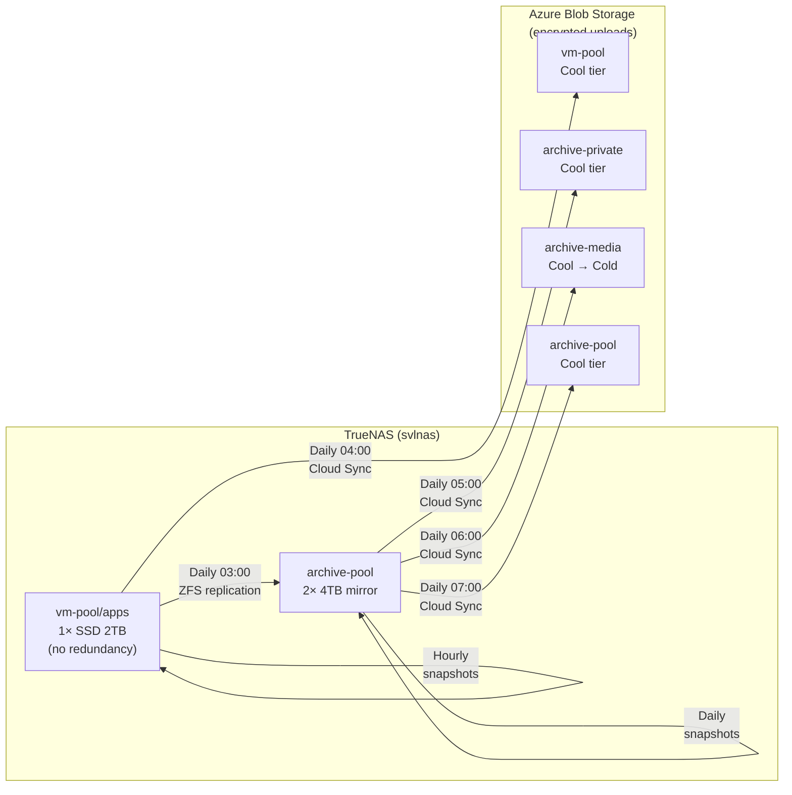

# Backup Strategy

This page documents the 3-2-1 backup strategy for the TrueNAS home lab: three copies of data, on two different storage media, with one copy off-site. For host-level storage layout and dataset conventions, see [Infrastructure](INFRASTRUCTURE.md). For full rebuild procedures, see [Disaster Recovery](DISASTER-RECOVERY.md).

## Risk Assessment

| Pool           | Disks                             | Redundancy                   | Risk                                                                                          | Impact                                                               |
| -------------- | --------------------------------- | ---------------------------- | --------------------------------------------------------------------------------------------- | -------------------------------------------------------------------- |
| `vm-pool`      | 1 × Samsung 970 Evo 2TB SSD       | **None**                     | Single-drive failure loses all app data, databases, secrets, and the git repo checkout        | **Critical** — all services down, data unrecoverable without backups |
| `archive-pool` | 2 × Seagate IronWolf 4TB (mirror) | Single-drive fault tolerance | Mirror degradation or double-drive failure loses media library, private photos, and documents | **High** — irreplaceable personal data at risk                       |

The vm-pool's lack of hardware redundancy makes cross-pool replication and off-site backup essential — not optional.

<!-- dprint-ignore -->
!!! danger "Known gap: TrueNAS VMs are NOT covered by off-site backup"
    ZFS VMs are stored as **zvols** (block devices), not regular files. rclone cannot
    read zvol data when traversing `/mnt/vm-pool/vms/`, so the `vm-pool-to-azure` Cloud
    Sync task silently skips the entire `vms/` directory without error.

    **What IS covered:** ZFS snapshots (Layer 1) and local replication to archive-pool
    (Layer 2) work correctly for zvols — `zfs send` includes zvol data. VMs survive an
    SSD failure but **not a total site loss (fire, theft).**

    **Current stance:** All VMs are treated as rebuildable. Any files inside a VM that
    must survive a site loss must be backed up out-of-band (e.g. copied to folders in `vm-pool/` or `archive-pool/`, which are picked up by Cloud Sync, or pushed to an external service directly from the VM).

    If a VM containing irreplaceable state is added in the future, revisit this with a VM-level backup agent.

---

## Recovery Objectives

| Metric                             | Target       | Rationale                                                                                                                                                              |
| ---------------------------------- | ------------ | ---------------------------------------------------------------------------------------------------------------------------------------------------------------------- |
| **RPO** (Recovery Point Objective) | **24 hours** | Daily backups are sufficient for a home lab. Hourly snapshots on vm-pool provide finer granularity for local rollback.                                                 |
| **RTO** (Recovery Time Objective)  | **≤ 1 week** | DNS runs also on a separate Azure VM (svlazext), so core network services survive a NAS failure. Full app stack rebuild can be done over several days without urgency. |

**What these targets mean in practice:**

- A vm-pool SSD failure loses at most 24 hours of data (last replication to archive-pool).
- A total site loss (fire/theft) loses at most 24 hours of data across all categories (app data, private photos, and media).
- Full rebuild from Azure Blob takes up to a week due to download bandwidth and the manual TrueNAS setup steps in [Disaster Recovery](DISASTER-RECOVERY.md).

---

## Architecture Overview


```mermaid
flowchart LR
    subgraph NAS["TrueNAS (svlnas)"]
        VM["vm-pool/apps\n1× SSD 2TB\n(no redundancy)"]
        ARC["archive-pool\n2× 4TB mirror"]
    end

    subgraph Azure["Azure Blob Storage\n(encrypted uploads)"]
        B1["vm-pool\nCool tier"]
        B2["archive-private\nCool tier"]
        B3["archive-media\nCool → Cold"]
        B4["archive-pool\nCool tier"]
    end

    VM -- "Hourly\nsnapshots" --> VM
    ARC -- "Daily\nsnapshots" --> ARC
    VM -- "Daily 03:00\nZFS replication" --> ARC
    VM -- "Daily 04:00\nCloud Sync" --> B1
    ARC -- "Daily 05:00\nCloud Sync" --> B2
    ARC -- "Daily 06:00\nCloud Sync" --> B3
    ARC -- "Daily 07:00\nCloud Sync" --> B4
```

| Copy                  | Location                               | Protects against                 |
| --------------------- | -------------------------------------- | -------------------------------- |
| **1 — Original**      | vm-pool (SSD) or archive-pool (mirror) | —                                |
| **2 — Local replica** | archive-pool/replication (mirror)      | SSD failure, accidental deletion |
| **3 — Off-site**      | Azure Blob Storage (encrypted)         | Fire, theft, flood, ransomware   |

<!-- TODO: [backup] Add a second off-site destination using Restic to a separate cloud provider tech & provider diversification -->

---

## TrueNAS Host Backup

The backup layers below protect pool data, but the TrueNAS system configuration itself (users, groups, network settings, cron jobs, Cloud Sync credentials, SMART/scrub schedules) also needs to be backed up.

### System Configuration File

Export the TrueNAS config after initial setup and after every significant change:

1. Go to **System → General Settings → Manage Configuration → Download File**
2. Enable **Export Password Secret Seed** (required to restore on a different boot device)
3. Upload the downloaded `.tar` file to your online password manager, then **delete the local copy** (including from trash) — it contains sensitive credentials

Also save an initial **system debug file** (~6 MB `.tgz`) via **System → Advanced Settings → Save Debug** as a baseline reference. Upload it to the same password manager entry.

To include the config file in automated off-site backups, save it into the git repo tree (e.g. `/mnt/vm-pool/apps/truenas-config/`) so it gets picked up by the `vm-pool` Cloud Sync task. The file is client-side encrypted before upload.

### Boot Environments

Before major TrueNAS upgrades, create a boot environment (System → Boot → clone the current BE) as an OS-level rollback point. TrueNAS creates one automatically on upgrade, but a manual pre-upgrade snapshot is a safety net if the automatic one fails.

---

<!-- TODO: [backup] Evaluate pull-based off-site backup where a second ZFS host initiates replication -->

## Layer 1: ZFS Periodic Snapshots

Snapshots provide instant, zero-cost local rollback. They protect against accidental deletion, bad upgrades, application-level corruption, and ransomware. Snapshots are **read-only** — a compromised application or malware process cannot modify or delete them. Only a root/admin ZFS user can destroy snapshots, which is why off-site backup (Layer 3) remains essential. Snapshots do **not** protect against drive failure.

### Configuration

Create these tasks in TrueNAS → Data Protection → Periodic Snapshot Tasks. Use naming schema `auto-%Y-%m-%d_%H-%M` (TrueNAS default) and **Allow Empty Snapshots: Yes** on every task. Click **Run Now** (▶) on each task after creating it to take an initial snapshot and verify the task works — then confirm the snapshots appeared in Storage → Snapshots.

When multiple tasks fire at the same minute (e.g. daily + weekly both at midnight Sunday), TrueNAS creates one snapshot and assigns it the longest lifetime — no duplicates.

**vm-pool** — 4 tasks, Recursive: Yes, Exclude: _(none)_

| # | Schedule | Lifetime | Effective retention | Expected "Frequency" in TrueNAS UI |
| - | -------- | -------- | ------------------- | ---------------------------------- |
| 1 | Hourly   | 1 day    | 24 rolling hourlies | Every hour, every day              |
| 2 | Daily    | 1 month  | 30 rolling dailies  | At 00:00, every day                |
| 3 | Weekly   | 1 month  | 4 rolling weeklies  | At 00:00, only on Sunday           |
| 4 | Monthly  | 3 months | 3 rolling monthlies | At 00:00, on day 1 of the month    |

**archive-pool** — 3 tasks, Recursive: Yes, Exclude: `archive-pool/replication`

| # | Schedule | Lifetime | Effective retention | Expected "Frequency" in TrueNAS UI |
| - | -------- | -------- | ------------------- | ---------------------------------- |
| 5 | Daily    | 1 month  | 30 rolling dailies  | At 00:00, every day                |
| 6 | Weekly   | 2 months | 8 rolling weeklies  | At 00:00, only on Sunday           |
| 7 | Monthly  | 3 months | 3 rolling monthlies | At 00:00, on day 1 of the month    |

The documented tasks select the **pool level with Recursive enabled**. Coverage
of child datasets depends on the actual recursion and exclusion settings, not
just the selected pool. After adding datasets, verify snapshots exist for each
child, including the shared `vm-pool/homes` dataset. Personal homes are ordinary
directories within its snapshots, not child datasets with their own timelines; see
[Personal Home Protection](#personal-home-protection).

> **Exclude replication datasets**: The archive-pool tasks **must** exclude `archive-pool/replication` (and its children). Snapshotting a replication target creates namespace collisions that can break subsequent replication runs — the replication task expects to manage snapshots on its target exclusively.

### Cleaning Up Old Snapshots

When you delete a Periodic Snapshot Task, TrueNAS stops creating new snapshots but does **not** delete existing ones — they become unmanaged orphans that persist indefinitely. If you deleted previous tasks and want a clean slate before the new tasks take over:

```sh
# Review existing snapshots first
zfs list -t snapshot -r vm-pool
zfs list -t snapshot -r archive-pool

# Bulk-destroy all auto-* snapshots (DESTRUCTIVE — review the list above first)
zfs list -t snapshot -r -H -o name vm-pool | grep '@auto-' | xargs -n1 zfs destroy
zfs list -t snapshot -r -H -o name archive-pool | grep '@auto-' | xargs -n1 zfs destroy
```

Similarly, any replicated datasets from deleted Replication Tasks persist and must be destroyed manually before creating the new replication task.

### Selective File Restore

Snapshots are browsable as read-only directories:

```sh
# List available snapshots for a dataset
ls /mnt/vm-pool/apps/.zfs/snapshot/

# Copy a single file from a snapshot (no rollback needed)
cp /mnt/vm-pool/apps/.zfs/snapshot/auto-2026-04-11_03-00/services/outline/data/db/PG_VERSION ./restored-file

# Browse a specific app's snapshot
ls /mnt/vm-pool/apps/services/immich/.zfs/snapshot/
```

Child datasets have their own independent snapshot timelines (accessible via `.zfs/snapshot/` within each dataset mountpoint), so you can restore one app without affecting others.

---

## Layer 2: Local Cross-Pool Replication

Replication copies vm-pool snapshots to the mirrored archive-pool, providing hardware redundancy for the single-SSD vm-pool. This is the **highest-priority** backup layer.

### Configuration

1. Create the **parent container** dataset in TrueNAS → Datasets → Add Dataset. The replication task will create the child (`vm-pool`) automatically on first run — do not pre-create it.

   | Setting            | Value                                                                                  |
   | ------------------ | -------------------------------------------------------------------------------------- |
   | Parent             | `archive-pool`                                                                         |
   | Name               | `replication`                                                                          |
   | Dataset Preset     | Generic                                                                                |
   | Compression        | Inherit (LZ4 from archive-pool — adequate for a container dataset)                     |
   | Enable Atime       | Off                                                                                    |
   | Snapshot Directory | `--` (Inherit — resolves to Invisible; `.zfs` accessible by path but hidden from `ls`) |
   | ACL Type           | Off (plain Unix permissions; safe — does not propagate to replicated child datasets)   |
   | ACL Mode           | Discard                                                                                |
   | Exec               | Off                                                                                    |
   | Encryption         | **None** — do not encrypt the container. The replicated child receives its encryption  |
   |                    | state from the replication stream (`vm-pool/apps` is ZFS-encrypted, so the replica     |
   |                    | arrives encrypted automatically)                                                       |

2. Create a Replication Task in TrueNAS → Data Protection → Replication Tasks (use Advanced mode):

   | Setting                                    | Value                                                                                                                                       |
   | ------------------------------------------ | ------------------------------------------------------------------------------------------------------------------------------------------- |
   | Name                                       | `vm-pool → archive-pool`                                                                                                                    |
   | Transport                                  | LOCAL                                                                                                                                       |
   | Allow Blocks Larger than 128KB             | Yes — improves throughput for large datasets                                                                                                |
   | Allow Compressed WRITE Records             | Yes — sends blocks pre-compressed, faster and lower CPU                                                                                     |
   | Source                                     | `vm-pool`                                                                                                                                   |
   | Recursive                                  | Yes                                                                                                                                         |
   | Include Dataset Properties                 | Yes — replicates compression, atime, etc.                                                                                                   |
   | Full Filesystem Replication                | No                                                                                                                                          |
   | Periodic Snapshot Tasks                    | Select all 4 vm-pool snapshot tasks                                                                                                         |
   | Only Replicate Snapshots Matching Schedule | No — replicates all snapshots from all 4 tasks (hourly, daily, weekly, monthly); enabling this would skip all but the 03:00 daily snapshots |
   | Save Pending Snapshots                     | No                                                                                                                                          |
   | Destination                                | `archive-pool/replication/vm-pool` (created automatically on first run)                                                                     |
   | Destination Dataset Read-only              | REQUIRE — prevents accidental writes to the replica                                                                                         |
   | Encryption                                 | No — source encryption is carried in the replication stream automatically                                                                   |
   | Replication from scratch                   | No                                                                                                                                          |
   | Snapshot Retention Policy                  | Same as Source — replica prunes in sync with source task lifetimes                                                                          |
   | Run Automatically                          | Yes                                                                                                                                         |
   | Schedule                                   | Daily at 03:00                                                                                                                              |

   Replication is strictly one-way: vm-pool → archive-pool/replication/vm-pool. The archive-pool snapshot tasks snapshot archive-pool's own datasets (private, content) independently — none of that flows through this task.

3. Run the task manually once to complete the initial full replication (this may take a while on first run). Subsequent runs are incremental (only changed blocks).

### Restore from Replica

If vm-pool fails:

1. Replace the failed SSD and create a new `vm-pool` pool
2. Create the `vm-pool/apps` dataset (with encryption — see [Disaster Recovery § Step 1](DISASTER-RECOVERY.md#step-1-create-zfs-datasets))
3. Create a one-time Replication Task in reverse: `archive-pool/replication/vm-pool` → `vm-pool`
4. Continue with [Disaster Recovery § Step 2](DISASTER-RECOVERY.md#step-2-create-users-and-groups) onward

---

## Layer 3: Off-Site — Azure Blob Cloud Sync

Cloud Sync tasks upload encrypted copies to Azure Blob Storage, providing geographic disaster recovery (fire, theft, flood).

### Azure Storage Account Setup

Create a **new** Storage Account (e.g. `truenasbackupsprod`). Version-level immutability **must be enabled at account creation** — it cannot be added to an existing account.

**Basics tab:**

| Setting          | Value                                                                                                                      |
| ---------------- | -------------------------------------------------------------------------------------------------------------------------- |
| Storage type     | Azure Blob Storage or Azure Data Lake Storage Gen 2                                                                        |
| Primary workload | Backup & Archive                                                                                                           |
| Performance      | Standard                                                                                                                   |
| Redundancy       | LRS (locally redundant — cost-effective for backup; RA-GRS adds cost for no benefit since ZFS replication is the HA layer) |

**Advanced tab:**

| Setting                             | Value                                                              |
| ----------------------------------- | ------------------------------------------------------------------ |
| Storage account key access          | Enabled (required — TrueNAS Cloud Sync only supports account keys) |
| Permitted scope for copy operations | From storage accounts in the same Microsoft Entra tenant           |
| Access tier                         | Cool                                                               |

**Networking tab:**

| Setting               | Value                                                                                   |
| --------------------- | --------------------------------------------------------------------------------------- |
| Public network access | Enabled from selected virtual networks and IP addresses                                 |
| IP allowlist          | Add the external IP of your home network (shared by both client and TrueNAS behind NAT) |
| Routing preference    | Microsoft network routing                                                               |

> **Dynamic IP risk**: Home ISPs typically assign dynamic IPs. If your external IP changes, Cloud Sync will fail with 403 errors. Update the firewall allowlist when your IP changes, or switch to "Enable from all networks" if this becomes a maintenance burden (still protected by account key + blob versioning + soft delete).

**Data Protection tab:**

| Setting                              | Value                                                                                                                                                                                 |
| ------------------------------------ | ------------------------------------------------------------------------------------------------------------------------------------------------------------------------------------- |
| Point-in-time restore for containers | **Disabled** — incompatible with version-level immutability                                                                                                                           |
| Soft delete for blobs                | Enabled — 14 days                                                                                                                                                                     |
| Soft delete for containers           | Enabled — 7 days                                                                                                                                                                      |
| Soft delete for file shares          | Enabled — 7 days (not used, but harmless)                                                                                                                                             |
| Enable versioning for blobs          | Enabled                                                                                                                                                                               |
| Enable blob change feed              | Enabled, keep all logs (audit trail of all create/modify/deletes)                                                                                                                     |
| Enable version-level immutability    | **Enabled** (Access control section) — enables WORM capability per container; no container policies are currently active (see [Step 2](#step-2--worm-retention-policies-not-applied)) |

**Encryption tab:**

| Setting                   | Value                                                                  |
| ------------------------- | ---------------------------------------------------------------------- |
| Encryption key management | Microsoft-managed keys                                                 |
| Infrastructure encryption | Enabled (double encryption at infrastructure layer — defense-in-depth) |

> **Important**: Version-level immutability (the account-level WORM capability) cannot be disabled once enabled. No container-level retention policies are currently configured — see [Step 2](#step-2--worm-retention-policies-not-applied) for the reasoning.

#### Step 1 — Create Four Containers

For each container, use Azure Portal → Storage Account → Data Storage → Containers → **+ Container**:

| Container         | Anonymous access level | Notes                                                        |
| ----------------- | ---------------------- | ------------------------------------------------------------ |
| `vm-pool`         | Private                | Apps, VMs, db dumps, secrets, config (whole pool)            |
| `archive-pool`    | Private                | Catch-all: docs, config — excl. replication/media/private/dl |
| `archive-private` | Private                | Immich photos, private documents                             |
| `archive-media`   | Private                | Media library (movies, music, TV, YouTube)                   |

Settings per container:

- **Anonymous access level**: Private (disabled at account level)
- **Encryption scope**: leave empty (uses the account default)
- **Enable version-level immutability support**: checked (inherited from account, cannot be unchecked)

#### Step 2 — WORM Retention Policies (Not Applied)

No container-level time-based retention policies are configured on any container.

**Why:** rclone (used by TrueNAS Cloud Sync) issues hard delete calls when propagating deletions in SYNC mode. Azure rejects these calls with a 409/412 error when a WORM policy is active — even if the deletion is intentional and the credential is valid. This causes the Cloud Sync task to fail every night for every file deleted from the NAS within the WORM retention window. There is no rclone flag to ignore only WORM-blocked deletes; `--ignore-errors` suppresses all errors, which masks real failures.

Policies were added initially (30 days on `vm-pool`, 90 days on `archive-private`) and removed on 2026-04-13 after observing the first run errors.

The account-level version-level immutability capability remains enabled — this is permanent and cannot be undone. If a WORM-compatible backup tool is adopted in the future (e.g. Restic, which uses an append-only model and never issues deletes during a backup run), per-container policies can be re-added at that time.

For now, ransomware protection relies on blob versioning, 14-day soft delete, and the resource lock. See [Azure-Side Ransomware Protection](#azure-side-ransomware-protection).

#### Step 3 — Verify Blob and Container Soft Delete

Blob soft delete (14 days) and container soft delete (7 days) were already configured during [storage account creation](#azure-storage-account-setup) on the Data Protection tab. Verify the settings are active:

Azure Portal → Storage Account → Data management → **Data protection** → under **Recovery**:

| Setting                           | Expected value |
| --------------------------------- | -------------- |
| Enable soft delete for blobs      | Enabled        |
| Days to retain deleted blobs      | **14**         |
| Enable soft delete for containers | Enabled        |
| Days to retain deleted containers | **7**          |

These are account-level settings — they apply to all containers equally.

#### Step 4 — Lifecycle Management for `archive-media`

Navigate to Storage Account → Data Management → **Lifecycle management** → switch to **Code view** and paste the following policy JSON:

```json
{
  "rules": [
    {
      "name": "archive-media-tier-to-cold",
      "enabled": true,
      "type": "Lifecycle",
      "definition": {
        "actions": {
          "baseBlob": {
            "tierToCold": {
              "daysAfterModificationGreaterThan": 7
            }
          }
        },
        "filters": {
          "blobTypes": ["blockBlob"],
          "prefixMatch": ["archive-media/"]
        }
      }
    },
    {
      "name": "archive-media-delete-old-versions",
      "enabled": true,
      "type": "Lifecycle",
      "definition": {
        "actions": {
          "version": {
            "delete": {
              "daysAfterCreationGreaterThan": 7
            }
          }
        },
        "filters": {
          "blobTypes": ["blockBlob"],
          "prefixMatch": ["archive-media/"]
        }
      }
    }
  ]
}
```

Two rules in this policy:

| Rule                                | What it does                          | Condition                                                                                              |
| ----------------------------------- | ------------------------------------- | ------------------------------------------------------------------------------------------------------ |
| `archive-media-tier-to-cold`        | Cool → Cold after 7 days              | Still online (ms access, no rehydration), ~half the cost of Cool                                       |
| `archive-media-delete-old-versions` | Delete previous versions after 7 days | Blob versioning is mandatory (account-level) but media doesn't need version history — keeps costs flat |

Archive tier is not used — at current data volumes (< 4 TB) the savings over Cold (~$10/month) don't justify the 180-day minimum retention and hours-long rehydration delay. This can be revisited if media grows significantly.

#### Step 5 — Create Cloud Credential

Create a Cloud Credential in TrueNAS → Credentials → Cloud Credentials using a **Storage Account access key**. TrueNAS Cloud Sync only supports account keys for Azure Blob Storage.

Account keys are data-plane credentials — they grant full read/write/delete access to blob data (including blob versions), but they **cannot** modify storage account settings (management plane). This means a compromised key cannot disable versioning, remove resource locks, or delete the account. The gap — that account keys _can_ delete individual blob versions — is closed by version-level immutability (WORM retention policies). See [Azure-Side Ransomware Protection](#azure-side-ransomware-protection).

### Cloud Sync Tasks

Create these tasks in TrueNAS → Data Protection → Cloud Sync Tasks → **Add**. Switch to **Advanced** mode. All four tasks share the same credential, encryption settings, and advanced options — only the fields listed per task differ.

#### Task A — `vm-pool-to-azure`

**Transfer:**

| Field           | Value              |
| --------------- | ------------------ |
| Description     | `vm-pool-to-azure` |
| Direction       | PUSH               |
| Transfer Mode   | SYNC               |
| Directory/Files | `/mnt/vm-pool`     |

**Remote:**

| Field      | Value                                  |
| ---------- | -------------------------------------- |
| Credential | _(your Azure Blob Storage credential)_ |
| Container  | `vm-pool`                              |
| Folder     | `/`                                    |

**Control:**

| Field    | Value               |
| -------- | ------------------- |
| Schedule | Custom: `0 4 * * *` |
| Enabled  | Yes                 |

**Advanced Options:**

| Field                                   | Value            |
| --------------------------------------- | ---------------- |
| Use Snapshot                            | No               |
| Create empty source dirs on destination | No               |
| Follow Symlinks                         | No               |
| Pre-script                              | _(empty)_        |
| Post-script                             | _(empty)_        |
| Exclude                                 | `iso/` ↵ `.zfs/` |

**Advanced Remote Options:**

| Field               | Value                     |
| ------------------- | ------------------------- |
| Use --fast-list     | No                        |
| Remote Encryption   | Yes                       |
| Filename Encryption | No                        |
| Encryption Password | _(from password manager)_ |
| Encryption Salt     | _(from password manager)_ |
| Transfers           | Low Bandwidth (4)         |
| Bandwidth Limit     | _(empty)_                 |

Covers files under `vm-pool`: apps, personal homes, db dumps, secrets, and the
git repo (not VM zvol contents; see the known gap above). Verify new homes,
including hidden files, are present remotely as described in
[Personal Home Protection](#personal-home-protection). `iso/` is excluded —
installer images have no restore value. All content is client-side encrypted
before upload. The documented TrueNAS cron runs `dccd.sh` every 15 minutes
with `-f`, so its one-shot database backup containers may run on every forced
full deployment. The latest successful dumps present when this task starts
are included in Cloud Sync.

---

#### Task B — `archive-private-to-azure`

**Transfer:**

| Field           | Value                       |
| --------------- | --------------------------- |
| Description     | `archive-private-to-azure`  |
| Direction       | PUSH                        |
| Transfer Mode   | SYNC                        |
| Directory/Files | `/mnt/archive-pool/private` |

**Remote:**

| Field      | Value                                  |
| ---------- | -------------------------------------- |
| Credential | _(your Azure Blob Storage credential)_ |
| Container  | `archive-private`                      |
| Folder     | `/`                                    |

**Control:**

| Field    | Value               |
| -------- | ------------------- |
| Schedule | Custom: `0 5 * * *` |
| Enabled  | Yes                 |

**Advanced Options:**

| Field                                   | Value     |
| --------------------------------------- | --------- |
| Use Snapshot                            | No        |
| Create empty source dirs on destination | No        |
| Follow Symlinks                         | No        |
| Pre-script                              | _(empty)_ |
| Post-script                             | _(empty)_ |
| Exclude                                 | `.zfs/`   |

**Advanced Remote Options:** _(same as Task A)_

Immich photos and private documents. Highest WORM retention (90 days) — irreplaceable personal data.

---

#### Task C — `archive-media-to-azure`

**Transfer:**

| Field           | Value                             |
| --------------- | --------------------------------- |
| Description     | `archive-media-to-azure`          |
| Direction       | PUSH                              |
| Transfer Mode   | SYNC                              |
| Directory/Files | `/mnt/archive-pool/content/media` |

**Remote:**

| Field      | Value                                  |
| ---------- | -------------------------------------- |
| Credential | _(your Azure Blob Storage credential)_ |
| Container  | `archive-media`                        |
| Folder     | `/`                                    |

**Control:**

| Field    | Value               |
| -------- | ------------------- |
| Schedule | Custom: `0 6 * * *` |
| Enabled  | Yes                 |

**Advanced Options:**

| Field                                   | Value     |
| --------------------------------------- | --------- |
| Use Snapshot                            | No        |
| Create empty source dirs on destination | No        |
| Follow Symlinks                         | No        |
| Pre-script                              | _(empty)_ |
| Post-script                             | _(empty)_ |
| Exclude                                 | `.zfs/`   |

**Advanced Remote Options:** _(same as Task A)_

Full media library. No WORM retention — old versions cleaned up by lifecycle rule after 7 days. Lifecycle policy moves blobs to Cold tier after 7 days. `downloads/` is not under `media/` so it's excluded by path scope.

---

#### Task D — `archive-pool-to-azure`

**Transfer:**

| Field           | Value                   |
| --------------- | ----------------------- |
| Description     | `archive-pool-to-azure` |
| Direction       | PUSH                    |
| Transfer Mode   | SYNC                    |
| Directory/Files | `/mnt/archive-pool`     |

**Remote:**

| Field      | Value                                  |
| ---------- | -------------------------------------- |
| Credential | _(your Azure Blob Storage credential)_ |
| Container  | `archive-pool`                         |
| Folder     | `/`                                    |

**Control:**

| Field    | Value               |
| -------- | ------------------- |
| Schedule | Custom: `0 7 * * *` |
| Enabled  | Yes                 |

**Advanced Options:**

| Field                                   | Value                                                                                            |
| --------------------------------------- | ------------------------------------------------------------------------------------------------ |
| Use Snapshot                            | No                                                                                               |
| Create empty source dirs on destination | No                                                                                               |
| Follow Symlinks                         | No                                                                                               |
| Pre-script                              | _(empty)_                                                                                        |
| Post-script                             | _(empty)_                                                                                        |
| Exclude                                 | `replication/` ↵ `content/media/` ↵ `private/` ↵ `content/downloads/` ↵ `TimeMachine/` ↵ `.zfs/` |

**Advanced Remote Options:** _(same as Task A)_

Catch-all for everything on `archive-pool` not captured by Tasks B and C, including the
operator-created `archives/` dataset when unlocked.
Excludes: `replication/` (ZFS replication target), `content/media/` (Task C), `private/`
(Task B), `content/downloads/` (transient), `TimeMachine/` (already a Mac backup), and
`.zfs/` (snapshot directories). The documented exclusions do not name `archives/`;
confirm the actual host filters and follow [Historical Archive Protection](#historical-archive-protection).
No WORM retention is active — versioning and soft delete offer limited recovery, not
permanent or immutable archive retention.

---

#### Cloud Sync Notes

**Exclude trailing slashes**: Every exclude entry must end with `/` (e.g. `.zfs/`, not `.zfs`). In rclone, the trailing slash marks it as a directory filter — without it, rclone may still recurse into the directory. The ↵ symbol above means press Enter between each exclude entry in the TrueNAS UI.

**Encryption**: Use the same password and salt across all four tasks (simpler key management) or unique ones per task (stronger isolation). **Store the password and salt in your password manager** — without them, encrypted blobs cannot be restored. Leave **Filename Encryption** deselected — plaintext filenames allow browsing and verifying backups in Azure Portal, but names remain visible even though content is encrypted. Use neutral filenames for sensitive exports.

**Use Snapshot**: Disabled on all tasks. TrueNAS only supports this on leaf datasets with no child datasets. Pool-level paths have nested children, producing the error _"This option is only available for datasets that have no further nesting."_ The consistency risk is minimal — db-backup sidecars produce application-consistent dumps before Cloud Sync runs, and media/config files are rarely written mid-sync.

**Exclusions**: `archive-pool/content/downloads/` and `archive-pool/TimeMachine/` are excluded — transient downloads have no backup value, and Time Machine backups are already a redundant copy of a Mac.

**Notifications**: Enable email notifications on task failure for all four tasks.

### Azure-Side Ransomware Protection

Blob versioning and soft delete protect against accidents, but a compromised account key could delete individual blob versions, removing the recovery points. Two hardening layers close this gap:

<!-- dprint-ignore -->
!!! warning "No WORM retention policies are active"
    Container-level time-based retention policies were intentionally removed because
    rclone SYNC mode issues hard deletes that Azure rejects when WORM is active, causing
    nightly task failures for every file deleted from the NAS. See
    [Step 2](#step-2--worm-retention-policies-not-applied) for full context.

    WORM-based immutability will be reconsidered when a WORM-compatible backup tool
    (such as Restic) is adopted — see [issue #154](https://github.com/DevSecNinja/truenas-apps/issues/154).

**1. Blob versioning + soft delete**

Blob versioning is enabled at the account level. Every overwrite creates a new current version; the previous version is retained for 14 days by soft delete. A compromised account key can delete the current version, but it becomes a soft-deleted previous version — still recoverable from Azure Portal or via API within the retention window.

How this protects against ransomware:

- Ransomware encrypts all NAS files → Cloud Sync uploads the encrypted versions as new current versions → the pre-encryption versions become soft-deleted previous versions → recoverable for 14 days
- A compromised account key cannot disable versioning or extend the soft delete window (management-plane operations)

The 14-day window is shorter than a WORM policy would provide. This is an accepted trade-off until a WORM-compatible backup tool is in place.

**2. Resource lock on the Storage Account**

In Azure Portal → Storage Account → Settings → Locks, create:

| Setting   | Value               |
| --------- | ------------------- |
| Lock name | `backup-protection` |
| Lock type | Delete              |

The lock prevents deletion of the storage account and its containers — even by users with Owner role. It must be manually removed before any destructive operation, adding a deliberate step that automated ransomware cannot perform. Account keys (data-plane) cannot remove locks (management-plane).

**Note on container soft delete**

Container soft delete (7 days) was already configured during [storage account creation](#azure-storage-account-setup) and verified in [Step 3](#step-3--verify-blob-and-container-soft-delete). This recovers an entire container if it is deleted — separate from blob-level soft delete.

**Recovery after a ransomware event:**

1. Identify the last clean version timestamp (before encryption date)
2. In Azure Portal, browse blob versions for the affected container
3. For each blob, select the last clean version → **Make current version**
4. Or use rclone/Cloud Sync Pull filtered by version timestamp to bulk-restore

### Restore from Azure Blob

1. Create a Cloud Sync task in **Pull** direction pointing at the desired Azure container
2. Set a local destination path (e.g. `/mnt/vm-pool/apps-restore/` or the final dataset directly)
3. Enable encryption with the same passphrase and salt used during upload
4. Run the task — TrueNAS decrypts blobs during download

For selective restore, use the **rclone** CLI directly on the TrueNAS host:

```sh
# List files in the encrypted remote (decrypted view)
rclone ls azure-crypt:vm-pool/apps/services/outline/backups/

# Copy a single directory
rclone copy azure-crypt:vm-pool/apps/services/outline/backups/ /mnt/vm-pool/apps/services/outline/backups/
```

This requires configuring an rclone remote with the crypt wrapper and appropriate credentials. See the [rclone crypt documentation](https://rclone.org/crypt/).

For the `archive-media` container, blobs move from Cool to Cold tier after 7 days via lifecycle policy. Cold tier is still online — blobs can be downloaded directly without rehydration, just like Cool tier blobs.

---

## Historical Archive Protection

The operator confirmed creation and ACL setup of `archive-pool/archives` on **2026-09-13**;
backup coverage has not yet been verified. See
[Historical Archives over SMB](INFRASTRUCTURE.md#historical-archives-over-smb)
for setup status, private ACLs, and safe imports. Classify these imported exports as
**critical retained file state / external historical archives**: they are original backup
files, not running databases. No live-database backup sidecar is required.

Expected coverage under the documented configuration:

- **Local snapshots:** the recursive `archive-pool` tasks exclude only `replication`,
  so they include `archives`. Retention is daily for **1 month**, weekly
  for **2 months**, and monthly for **3 months**; there are no hourly snapshots.
- **Off-site:** [Task D — `archive-pool-to-azure`](#task-d-archive-pool-to-azure)
  runs daily at **07:00**, in **SYNC** mode to the Azure `archive-pool` container.
  Contents are client-side encrypted; **filename encryption is off**, so use neutral
  filenames for sensitive files. No new Azure task is needed if the actual filters
  match the documented configuration.
- **Limits:** the mirror is hardware redundancy, not an independent backup, and snapshots
  share the pool's failure domain. Layer 2 only replicates `vm-pool` to `archive-pool`;
  it does **not** replicate `archives` back to `vm-pool`. SYNC mirrors deletions;
  Azure versioning/soft delete are limited recovery mechanisms, not immutable retention.

Retain imported archive files until deliberate manual cleanup; do not apply the sidecars'
48-hour dump cleanup policy to this dataset. Snapshot expiry is separate from file retention.

After each ingest, before declaring the files protected or deleting source originals:

1. Confirm the dataset is unlocked and the host's recursive snapshot tasks and Task D are
   enabled. Check their actual source, exclusions, and any additional filters include
   `archives`; this guide alone is not evidence of host configuration.
2. Finish copying, verify source/destination hashes or representative readback/restore,
   then run an archive-pool snapshot task and Task D. Confirm a snapshot exists for
   `archive-pool/archives`, Cloud Sync succeeds, and the expected off-site files are present.
3. Restore a sample from the Azure `archive-pool` container's `archives/` directory to an
   **isolated target** using [Restore from Azure Blob](#restore-from-azure-blob).
   Decrypt with the Cloud Sync password/salt, then the independent client encryption
   key if used. Verify hashes and a representative application restore before source cleanup.

For local recovery, copy individual files from
`/mnt/archive-pool/archives/.zfs/snapshot/<snapshot-name>/` into an isolated restore target,
or use the Azure procedure above. Verify the recovered files before copying selected files
back over SMB. **Do not roll back the entire archive dataset** to recover a single archive.

---

## Personal Home Protection

The [Personal Home Folders](HOME-FOLDERS.md) design is native TrueNAS storage,
not an app. **Home configuration, backup coverage, and restores have not been
tested on the live host.** The following is the required operator acceptance
procedure, not a claim that the documented tasks already protect new homes.

One `vm-pool/homes` snapshot includes **all users' ordinary home directories**.
They share the dataset's snapshot schedule, replication policy, and encryption
root; there are no per-user snapshots or independent rollbacks. User quotas
limit ownership-based live usage, not per-user snapshot-retention space.
Monitor shared snapshot growth, the dataset quota, and pool reserve.

| Path under `/mnt/vm-pool/homes/<username>`                      | Classification                                                  | Protection                                                  |
| --------------------------------------------------------------- | --------------------------------------------------------------- | ----------------------------------------------------------- |
| `.ssh`, `.config`, shell dotfiles, other personal configuration | Critical mutable file state, including credentials/SSH material | Snapshots, replication, encrypted off-site copy             |
| `Files/`                                                        | Critical mutable file state (personal documents)                | Same layers; SMB access does not change backup requirements |
| Proven regeneratable cache paths only                           | Regeneratable cache                                             | Optional narrowly scoped exclusion after review             |

Do not exclude all hidden files or `.config` as caches. No databases are
introduced and no database backup sidecar is needed. If a user later runs a
live database in a home, require a separate reviewed application-consistent
backup; file sync and raw snapshots alone are not that backup.

### Verify Home Coverage

1. Confirm the shared `vm-pool/homes` dataset is mounted/unlocked. Check the actual
   **recursive** `vm-pool` snapshot tasks, exclusions, and snapshots for
   `homes`, then find each user's ordinary directory inside those snapshots.
   Do not look for a separate snapshot per username dataset. The documented
   retention is hourly for 1 day, daily/weekly for 1 month, and monthly for
   3 months, shared by all homes.
2. Check the actual recursive replication source, selected snapshots,
   exclusions, destination, and successful runs. The documented daily
   **03:00** task targets `archive-pool/replication/vm-pool`; verify the
   `archive-pool/replication/vm-pool/homes` dataset and its snapshots contain
   all users' ordinary directories.
   Protect destination permissions and retain the read-only replication
   target; do not expose backup copies in SMB shares.
3. Verify [Task A](#task-a-vm-pool-to-azure), daily at **04:00**, reads the
   unlocked shared dataset and uploads each user's files to the Azure
   `vm-pool` container's `homes/<username>/` prefix. Inspect filters and actual
   remote contents for **hidden files, SSH configuration, and `Files`**, not
   just a successful pool-level task.
   The documented exclusions are `iso/` and `.zfs/`; do not accidentally
   broaden these to personal configuration.
4. Protect backup destination access and store the shared encryption root's
   ZFS unlock keys, Cloud Sync password/salt, and recovery credentials
   independently of the NAS.
   Contents are encrypted but **filenames are not**. SYNC propagates
   deletions; versioning/soft delete are not immutable retention.
5. Export the updated [system configuration and password secret seed](#system-configuration-file).
   Securely record personal usernames, exact UID/GID values, home paths,
   share definitions, shared-root and personal ACLs, and dataset/user quotas
   for recovery.

Task A reads live files rather than snapshots. Finish/quiesce writes before a
representative restore test; do not promise transaction consistency for
applications writing several related home files.

### Restore Home Files

Before relying on the backups, restore **one `Files` document and one existing
SSH-only file** (for example `.ssh/config`, if present) from both a snapshot
and the encrypted off-site copy:

1. Select a known-good recovery point. Browse the user's directory **inside
   the shared dataset snapshot** at
   `/mnt/vm-pool/homes/.zfs/snapshot/<snapshot-name>/<username>/`, or use
   [Restore from Azure Blob](#restore-from-azure-blob) with the saved
   encryption password/salt and that user's `homes/<username>/` prefix.
2. Copy to an **isolated, access-restricted restore path**, not into a live
   home or SMB export. Verify contents/checksums, including hidden files.
3. Check numeric ownership against the recorded personal UID/GID, NFSv4
   ACLs and inheritance, and modes: home/`.ssh` `0700`, `authorized_keys`
   `0600`. File-copy/cloud restores may not preserve UID/GID or NFSv4 ACLs.
   Reapply and verify the intended folder/file permissions before enabling
   shares/logins or copying selected recovered files back. Inspect the home
   itself and the share's `Files` filesystem ACL, not the dataset root as if
   it were one user's home; never blanket-recursively chown/reset all homes.
4. For a full recovery, restore the same identities and follow
   [Personal Home Recovery](DISASTER-RECOVERY.md#personal-home-recovery).
   Recheck SSH-only versus SMB access with both the owner and another
   ordinary user, and record restore evidence in the operator inventory.

**Rolling back `vm-pool/homes` affects every user.** For one home or file,
copy out selected files without rolling back the shared dataset or discarding
other users' newer work. Retention of home files is independent of the app
database sidecars' 48-hour cleanup policy.

---

## Application-Level Database Backups

The following stateful databases have application-consistent backup sidecars
in their compose files today. Dawarich uses maintained
`docker.io/nfrastack/db-backup:4.9.2`; the other stacks currently use
`tiredofit/db-backup` v4. These produce compressed, encrypted dump files
independent of ZFS snapshots — providing an application-consistent recovery
point that a raw filesystem snapshot may not guarantee (especially for
PostgreSQL WAL consistency). **Not every service with an embedded database has
this layer yet** — see [Persistent State Inventory](#persistent-state-inventory-beyond-application-level-backups)
below for the full audit of what currently relies on storage-layer (ZFS
snapshot/replication/off-site) coverage only, and note that coverage itself
is not uniform across every path.

### Covered Databases

| Service        | Database   | Backup sidecar             | Image family    | Encryption | Output path                                  |
| -------------- | ---------- | -------------------------- | --------------- | ---------- | -------------------------------------------- |
| Bitwarden      | SQLite     | `bitwarden-db-backup`      | tiredofit v4    | GPG        | `services/bitwarden/backups/db-backup/`      |
| Dawarich       | PostgreSQL | `dawarich-db-backup`       | nfrastack 4.9.2 | GPG        | `services/dawarich/backups/db-backup/`       |
| Gatus          | PostgreSQL | `gatus-db-backup`          | tiredofit v4    | GPG        | `services/gatus/backups/db-backup/`          |
| Home Assistant | SQLite     | `home-assistant-db-backup` | tiredofit v4    | GPG        | `services/home-assistant/backups/db-backup/` |
| Immich         | PostgreSQL | `immich-db-backup`         | tiredofit v4    | GPG        | `services/immich/backups/db-backup/`         |
| Karakeep       | SQLite     | `karakeep-db-backup`       | tiredofit v4    | GPG        | `services/karakeep/backups/db-backup/`       |
| Memos          | SQLite     | `memos-db-backup`          | tiredofit v4    | GPG        | `services/memos/backups/db-backup/`          |
| Outline        | PostgreSQL | `outline-db-backup`        | tiredofit v4    | GPG        | `services/outline/backups/db-backup/`        |
| Unifi          | MongoDB    | `unifi-db-backup`          | tiredofit v4    | GPG        | `services/unifi/backups/db-backup/`          |

### How They Run

The db-backup sidecars run one backup and exit. They are started by each full
`dccd.sh` deployment, so backup cadence follows the administrator's dccd cron
schedule rather than an intrinsic nightly schedule. The documented TrueNAS
cron runs every 15 minutes with `-f`, so a one-shot backup may run on every
forced full deployment. Dumps are:

- Compressed with zstd (gzip for MongoDB — `mongodump --gzip` is invoked directly)
- SHA1-checksummed
- Encrypted with `DB_ENC_PASSPHRASE` from each app's `secret.sops.env`
- Retained for 2880 minutes (48 hours), which bounds the stored backup count
  according to the actual dccd cadence

`dccd-all` enables the `dccd.sh -B` end-of-run check by default. It waits up to
the configured `WAIT_TIMEOUT` for active `*-db-backup` services and requires
each container to have exited with status 0, have a `FinishedAt` timestamp
within the previous 48 hours, and include the backup image's successful
completion marker (`Backup NN routines finish time: ... with exit code 0`) in
Docker logs read since the container's latest `StartedAt`, excluding retained
older-run success markers while allowing final buffered output after
`FinishedAt`. If any check fails, `dccd.sh` fails. Disable the check for one
invocation with:

```sh
DCCD_CHECK_BACKUPS=0 dccd-all
```

`false` and `no` are also accepted instead of `0`.

Dawarich's nfrastack `4.9.2` compatibility sidecar runs `backup-now` with
`MODE=MANUAL` on every full `dccd.sh` deployment. It uses
`DEFAULT_COMPRESSION=ZSTD`, `DEFAULT_CHECKSUM=SHA1`,
`DEFAULT_ENCRYPT=TRUE`, and
`DEFAULT_ENCRYPT_PASSPHRASE=${DB_ENC_PASSPHRASE}` to produce a
ZSTD-compressed, GPG-encrypted PostgreSQL dump with a SHA1 sidecar.
`DEFAULT_CLEANUP_TIME=2880` retains the artifacts for 2880 minutes. The
sidecar maps its internal identity with `USER_DBBACKUP=3128` and
`GROUP_DBBACKUP=3128`. `ENABLE_NOTIFICATIONS=FALSE` keeps it backend-only;
Dawarich's remaining `NOTIFICATIONS_EMAIL_*` variables are application-only.

The tiredofit v4 sidecars produce GPG-encrypted backups. Notification behavior
is configured per app; Karakeep and Memos disable sidecar notifications and
rely on the `dccd.sh -B` freshness check.

Karakeep's hardened backup configuration separately passed a synthetic Podman
5.8.6 end-to-end test with a live WAL-mode source and the exact pinned
`tiredofit/db-backup:4.1.100` image. s6 started as root with all capabilities
dropped except `CHOWN`, `DAC_OVERRIDE`, `FOWNER`, `SETGID`, `SETUID`, and
`SETPCAP`, then dropped the backup process to the app-owned `3130:3130`
identity through `USER_DBBACKUP` and `GROUP_DBBACKUP`. `DAC_OVERRIDE` was
runtime-proven necessary for s6 to create root-owned runtime paths before that
privilege drop; the remaining capabilities are the documented s6
path-preparation and privilege-drop set.

The test produced an encrypted GPG+ZSTD artifact and SHA1 sidecar, restored the
database, returned `ok` from the integrity check, and matched the sentinel row.
The sidecar used the production parent mount and
`DEFAULT_FILESYSTEM_PATH=/backup-data/db-backup`; the child retained the
ownership prepared by `karakeep-init`, and host output remained exactly
`./backups/db-backup`. This was not a production deployment or a test on the
TrueNAS host.

<!-- dprint-ignore -->
!!! note "Why Dawarich remains on the v4 workflow"
    Version 5.0.0 was intentionally not selected because runtime restore
    validation failed with an invalid bigint conversion. The maintained
    nfrastack `4.9.2` compatibility release preserves the proven v4 workflow.
    Runtime testing successfully decrypted its dump and restored it into a fresh
    PostgreSQL database.

### Restore a Database Dump

1. Locate the dump file (locally or download from Azure Blob — see [Layer 3 restore](#restore-from-azure-blob)):

   ```sh
   ls services/immich/backups/db-backup/
   ```

2. Decrypt with GPG using `DB_ENC_PASSPHRASE`, then decompress the dump:
   - **Dawarich nfrastack 4.9.2 and tiredofit v4 PostgreSQL/SQLite backups:**
     GPG-encrypted and zstd-compressed.
   - **MongoDB backups:** GPG-encrypted and gzip-compressed because the sidecar
     invokes `mongodump --gzip`.

   The following commands apply to the GPG-encrypted backups:

   ```sh
   # PostgreSQL / SQLite — *.zst.gpg
   gpg --batch --passphrase "<DB_ENC_PASSPHRASE>" \
     --output pgsql_immich_immich_20260411-020000.sql.zst \
     --decrypt pgsql_immich_immich_20260411-020000.sql.zst.gpg
   zstd -d pgsql_immich_immich_20260411-020000.sql.zst

   # MongoDB — *.archive.gz.gpg
   gpg --batch --passphrase "<DB_ENC_PASSPHRASE>" \
     --output mongo_unifi_unifi_20260411-020000.archive.gz \
     --decrypt mongo_unifi_unifi_20260411-020000.archive.gz.gpg
   gunzip mongo_unifi_unifi_20260411-020000.archive.gz
   ```

3. Restore — the procedure depends on the database engine:

   **PostgreSQL** (Dawarich, Gatus, Immich, Outline) — plain-text `pg_dump` SQL
   after decrypting and decompressing with the matching image-generation
   workflow:

   ```sh
   # Copy the plain-text SQL dump into the container
   docker cp pgsql_immich_immich_20260411-020000.sql immich-db:/tmp/

   # Restore the plain-text pg_dump output with psql
   docker exec -it -e PGPASSWORD='<password>' immich-db psql \
     -U immich -d immich -f /tmp/pgsql_immich_immich_20260411-020000.sql
   ```

   **MongoDB** (Unifi) — `mongodump --archive --gzip` single-file binary archive (gzip already removed in step 2):

   ```sh
   docker cp mongo_unifi_unifi_20260411-020000.archive unifi-db:/tmp/restore.archive

   docker exec -it unifi-db mongorestore \
     --username root --password '<password>' \
     --authenticationDatabase admin \
     --drop \
     --archive=/tmp/restore.archive
   ```

   **SQLite** (Home Assistant, Karakeep, Memos) — binary copy via the SQLite
   Online Backup API. The `.sqlite3`/`.db` file is a complete database, not a
   `.dump`, so it can replace the live DB while the application is stopped:

   ```sh
   # Stop the Home Assistant stack first so the recorder DB isn't being written.
   docker compose -f services/home-assistant/compose.yaml down

   # Move the existing DB aside and drop in the restored copy.
   mv services/home-assistant/data/config/home-assistant_v2.db{,.bak}
   cp sqlite3_home-assistant_home-assistant_20260411-020000.sqlite3 \
     services/home-assistant/data/config/home-assistant_v2.db

   # Verify integrity, then restart.
   sqlite3 services/home-assistant/data/config/home-assistant_v2.db \
     "PRAGMA integrity_check;"
   docker compose -f services/home-assistant/compose.yaml up -d
   ```

   Karakeep runs SQLite in WAL mode. Stop the stack and remove the stale
   `db.db-wal` and `db.db-shm` files before installing the restored database;
   those sidecars belong to the previous `db.db`. Restore ownership to
   `3130:3130` and the init container's restrictive modes across the Karakeep
   data directory so the non-root processes can write the database and create
   new WAL/SHM files. The normal `truenas_admin` operator requires elevated
   privileges for the file operations and integrity check because Karakeep has
   `admin_group_member=false`, and the restored tree becomes accessible only to
   `svc-app-karakeep`.

   ```sh
   # Stop Karakeep so nothing holds the database or WAL open.
   docker compose -f services/karakeep/compose.yaml down

   # Preserve the current database and remove sidecars from that old database.
   sudo mv services/karakeep/data/karakeep/db.db{,.bak}
   sudo rm -f services/karakeep/data/karakeep/db.db-wal \
     services/karakeep/data/karakeep/db.db-shm

   # Install the decrypted, decompressed database backup.
   sudo cp /path/to/restored-karakeep-db.db \
     services/karakeep/data/karakeep/db.db

   # Verify the restored database.
   sudo sqlite3 services/karakeep/data/karakeep/db.db \
     "PRAGMA integrity_check;"

   # Match karakeep-init before restart. Directory write access is required
   # for SQLite to create new WAL/SHM files.
   sudo chown -R 3130:3130 services/karakeep/data/karakeep
   sudo chmod -R u=rwX,g=,o= services/karakeep/data/karakeep

   # Restart Karakeep after integrity_check returns "ok".
   docker compose -f services/karakeep/compose.yaml up -d
   ```

   This restores only the SQLite database. Restore
   `services/karakeep/data/karakeep/assets` separately from the corresponding
   storage-layer recovery point when asset files also need recovery. The
   Meilisearch index is regeneratable.

   Memos follows the same pattern but runs SQLite in WAL mode, so the live
   directory may still contain `memos_prod.db-wal`/`memos_prod.db-shm`
   sidecar files from the running (or crashed) process. Restoring only the
   main `.db` file while leaving stale WAL/SHM files in place can reapply old
   uncommitted writes on top of the restored database or make SQLite refuse
   to open it cleanly — remove them before restarting. Memos also runs as
   the non-root `3129:3129` (`svc-app-memos`) account, so the restored file
   must be `chown`'d back to that UID/GID before the container can write to
   it again:

   ```sh
   # Stop Memos so nothing holds the SQLite file (or its WAL) open.
   docker compose -f services/memos/compose.yaml down

   # Move the existing DB aside; remove stale WAL/SHM sidecar files — they
   # belong to the old database file, not the restored one.
   mv services/memos/data/memos_prod.db{,.bak}
   rm -f services/memos/data/memos_prod.db-wal services/memos/data/memos_prod.db-shm

   # Drop in the restored (decrypted, decompressed) database file copy.
   cp sqlite3_memos_memos_20260411-020000.db services/memos/data/memos_prod.db

   # Memos runs as non-root 3129:3129 (svc-app-memos) — restore that ownership
   # on the copied file before the container starts writing to it again.
   chown 3129:3129 services/memos/data/memos_prod.db

   # Verify integrity before restarting Memos.
   sqlite3 services/memos/data/memos_prod.db "PRAGMA integrity_check;"
   docker compose -f services/memos/compose.yaml up -d
   ```

   Memos 0.30 defaults attachment storage to SQLite blobs rather than local
   files, so restoring `memos_prod.db` alone restores both notes and
   attachments as of that backup — there is no separate attachment directory
   to reconcile under the default configuration. If the storage driver is
   later changed to local disk or S3, this restore procedure must be revisited.

The `Backup Restore Test` GitHub Actions workflow
(`scripts/gha-backup-restore-test.sh`) exercises the tiredofit v4 GPG workflow
for PostgreSQL, MongoDB, and SQLite every Saturday. Dawarich's maintained
nfrastack `4.9.2` compatibility image uses the same proven v4 GPG workflow; its
runtime-produced dump has also been decrypted and restored into a fresh
PostgreSQL database.

---

## Restore changedetection.io file state

changedetection.io persists **critical mutable file state**, not SQLite or
another formal database. The entire
`services/changedetection/data/` directory is mounted at `/datastore` and
contains global/watch/tag JSON files, `secret.txt`, history snapshots, and
screenshots. Session/API secrets are generated by the app in this persisted
state; restoring only watch definitions does not restore the complete
instance.

Browser fetching is enabled under an exact-version accepted-risk exception.
Preserve historical screenshots and watch settings; restoring files does not
justify broadening that exception or reverting to old browser definitions.
See [current browser configuration](services/changedetection.md#browser-and-networks).

The directory receives existing **vm-pool 3-layer** coverage: recursive ZFS
snapshots, cross-pool replication, and encrypted off-site Cloud Sync (Task A).
There is no `changedetection-db-backup` sidecar or encrypted database dump
because there is no database engine. The `dccd-all` database freshness check
does not prove that this file state is backed up.

<!-- dprint-ignore -->
!!! warning "A live snapshot is not a multi-file transaction"
    Files can be saved separately while the app is running. A live ZFS
    snapshot preserves a filesystem point in time, not necessarily a mutually
    consistent set of global, watch, tag, and history files. Replication and
    off-site copies do not repair that consistency limitation. Gracefully
    stop the app before a manual consistent snapshot or full-directory export.
    The upstream ZIP backup may have limited history coverage; do not assume
    it can replace a complete datastore restore.

### Safe Recovery Procedure

1. Suspend scheduled dccd deployment and any other automation that could
   restart this app. Record the application image version/digest associated
   with the recovery point; restore with that app version before attempting
   an upgrade. Keep all writers stopped until the file restore is complete.
2. Stop the `changedetection` Custom App through TrueNAS, allowing the
   configured 60-second graceful-stop period. Confirm the application has
   exited and no other instance is writing `/datastore`. If shutdown is
   forced or fails, do not label a subsequent snapshot application-consistent.
3. Preserve the **complete failed `data/` tree**, including hidden files and
   secrets, in a restricted recovery workspace outside the Git checkout.
   Take a protective snapshot where possible. Retain the original recovery
   source and failed tree until recovery is verified; do not delete them.
4. Select a complete recovery point, preferably captured after a graceful
   stop. Browse this child dataset's own
   `/mnt/vm-pool/apps/services/changedetection/.zfs/snapshot/<snapshot-name>/data/`,
   recover the equivalent directory from the local replica, or download it
   through [Restore from Azure Blob](#restore-from-azure-blob). Restore into
   a restricted staging location first, not onto the running app. A live
   snapshot or file-by-file Cloud Sync copy requires additional scrutiny;
   completeness alone does not establish multi-file consistency.
5. Verify the staged tree includes the global/watch/tag JSON, `secret.txt`,
   history snapshots, and screenshots expected for that recovery point.
   Check JSON readability and available backup checksums, but do not treat
   syntactically valid JSON as proof of cross-file consistency. Keep
   credentials, notification URLs, page contents, and screenshots private.
6. With the app still stopped, move the preserved failed tree aside and
   install the complete recovered directory at
   `/mnt/vm-pool/apps/services/changedetection/data/`. Use elevated privileges
   and preserve files, subdirectories, and hidden entries. Do not overlay a
   partial restore onto old files, combine recovery points, or roll back
   sibling datasets.
7. Re-run `changedetection-init` to successful completion in the existing
   TrueNAS app project before starting the application. It restores
   ownership to `svc-app-changedetection` and restrictive `u=rwX,g=,o=`
   permissions. Before using the normal deployment path
   (`dccd-app changedetection`), confirm the merged Compose configuration
   selects the intended compatible image: dccd pulls merged changes, not
   necessarily the version associated with the backup. Verify init completed;
   do not start a second Compose project or bypass init. Stop on
   init/permission errors rather than weakening access.
8. Sign in through SSO and verify settings, watch/tag counts, representative
   historical diffs, and screenshots. Check application logs for missing
   files or parse errors, then test a public JavaScript watch, screenshot, and
   notification. Existing Basic HTTP watch settings are not automatically
   migrated; select the browser fetcher explicitly where wanted, without
   silently rewriting other stored watch settings.
   Account for outbound watch checks/notifications resuming at startup.
   Only then resume deployment automation and confirm all three backup
   layers include the restored directory.

For a manual consistent snapshot/export without a restore, suspend redeploys,
gracefully stop and confirm the writer has exited, then snapshot the child
dataset or copy the entire `data/` tree while it remains stopped. Resume the
normal deployment only after capture finishes.

### Upstream Storage References

The file-state classification is based on changedetection.io `0.60.7`, at
upstream commit `593e9cc48c2b475dacbc3dbdebe2f5136bef8efa`:

- [Store initialization and settings](https://github.com/dgtlmoon/changedetection.io/blob/593e9cc48c2b475dacbc3dbdebe2f5136bef8efa/changedetectionio/store/__init__.py)
- [File-saving datastore](https://github.com/dgtlmoon/changedetection.io/blob/593e9cc48c2b475dacbc3dbdebe2f5136bef8efa/changedetectionio/store/file_saving_datastore.py)
- [Flask application and session-secret handling](https://github.com/dgtlmoon/changedetection.io/blob/593e9cc48c2b475dacbc3dbdebe2f5136bef8efa/changedetectionio/flask_app.py)

A pre-DHI baseline file-state backup/restore passed on Linux amd64 with rootless
Podman `5.8.3`, Compose `5.4.0`, and all three exact image digests pinned for
changedetection.io. An API-created browser watch produced persisted history
and a PNG screenshot. After gracefully stopping the app, the entire datastore
was tar-archived, the original tree retained, and the archive restored into a
fresh directory. Init exited `0`; after force-recreating Chrome and the app,
the same watch, history, screenshot, and HTTP CDP rediscovery were verified.
This evidence covers this app's file-state restore, not a database restore,
TrueNAS production deployment, or recovery through ZFS, replication, or
off-site storage. Synthetic proxy auth routing passed with disposable Traefik
`3.7.10`, the actual app router/middleware labels, and synthetic Forward Auth:
both UI and API returned `401` without authorization and `200` with
authorization. Real Entra/production SSO, TLS termination, and interactive
visual-selector tests remain pending. This historical evidence does not prove
that the current DHI browser works or is patched. Browser execution is now
enabled in Compose under the operator's exact-version risk exception;
completed synthetic DHI checks are recorded separately in
[Browser Runtime Validation](ARCHITECTURE.md#browser-runtime-validation).
They are not a new file-state restore test, a CVE fix, or production TrueNAS
validation.

---

## Persistent State Inventory (Beyond Application-Level Backups)

This section audits **every** `services/*/compose.yaml` in the repository —
not just the apps most likely to have a database — for bind-mounted or named
persistent writable paths, classifies what each one holds, and states the
actual storage-layer coverage it receives. Coverage is **not uniform**: it
depends on which pool and sub-path a service's data lives under, so each
entry below states its specific coverage rather than a blanket claim.

### Classification

- **Database** — an embedded or external data store with its own consistency
  semantics (WAL, transactions). A raw filesystem snapshot mid-write carries
  non-zero corruption risk without engine cooperation (online backup API,
  quiescing, or a transactional dump).
- **Critical mutable file state** — hand-authored or generated files that are
  expensive or impossible to reconstruct (device pairings, credentials,
  configuration written through a UI, uploaded attachments) but are not a
  formal database engine.
- **Regeneratable cache** — safe to lose; rebuilt automatically or holds
  low-value history/log data.
- **External/media data** — large media/library content stored outside a
  service's own `./data` (typically on `archive-pool`).

### Storage-Layer Coverage Reference

The tables below cite one of these coverage levels instead of a generic "ZFS
layers" claim, because coverage genuinely differs by pool and sub-path:

| Coverage label                             | What it means                                                                                                                                                                                                                                                                                                                                                                      |
| ------------------------------------------ | ---------------------------------------------------------------------------------------------------------------------------------------------------------------------------------------------------------------------------------------------------------------------------------------------------------------------------------------------------------------------------------- |
| **vm-pool 3-layer**                        | The service's data lives under `services/<app>/` on `vm-pool`. Covered by [Layer 1](#layer-1-zfs-periodic-snapshots) (hourly/daily/weekly/monthly snapshots), [Layer 2](#layer-2-local-cross-pool-replication) (daily replication to `archive-pool`), and [Layer 3](#layer-3-off-site-azure-blob-cloud-sync) Task A (`vm-pool` → Azure, daily — excludes only `iso/` and `.zfs/`). |
| **archive-pool (private)**                 | Path is under `archive-pool/private/`. Covered by the archive-pool snapshot tasks (daily/weekly/monthly — **no hourly**), the archive-pool mirror's own hardware redundancy (substitutes for cross-pool replication), and Cloud Sync **Task B** (`archive-private`, daily).                                                                                                        |
| **archive-pool (media)**                   | Path is under `archive-pool/content/media/`. Same snapshot/mirror coverage as above, plus Cloud Sync **Task C** (`archive-media`, daily; tiers to Cold after 7 days).                                                                                                                                                                                                              |
| **archive-pool (downloads — no off-site)** | Path is under `archive-pool/content/downloads/`. Covered **only** by local archive-pool snapshots — this sub-path is explicitly excluded from every Cloud Sync task (Task C only covers `media/`; Task D's exclude list names `content/downloads/` directly). There is **no off-site copy**.                                                                                       |
| **archive-pool (catch-all)**               | Any other archive-pool path not matched above. Covered by archive-pool snapshots plus Cloud Sync **Task D** (`archive-pool`, daily).                                                                                                                                                                                                                                               |
| **None**                                   | No persistent writable state exists for this path (stateless, tmpfs-only, or strictly read-only).                                                                                                                                                                                                                                                                                  |

### Additional Persistent Paths in Covered-Database Apps

The apps in [Covered Databases](#covered-databases) have a `*-db-backup`
sidecar for their primary database, but several also persist additional
state on disk that the sidecar does **not** include in its dump (it only
backs up the named database engine, not arbitrary files on the volume).

| Service        | Persistent path                                      | Classification                                                                                                                               | Storage-layer coverage        | Notes                                                                                                                                                                                     |
| -------------- | ---------------------------------------------------- | -------------------------------------------------------------------------------------------------------------------------------------------- | ----------------------------- | ----------------------------------------------------------------------------------------------------------------------------------------------------------------------------------------- |
| Bitwarden      | `./data/logs`                                        | Regeneratable cache (application logs)                                                                                                       | vm-pool 3-layer               | Low value; safe to lose.                                                                                                                                                                  |
| Dawarich       | `./data/public`, `./data/storage`                    | **Critical mutable file state** (Rails Active Storage uploads — imports, generated exports, and, if used, photos)                            | vm-pool 3-layer               | **Not** included in `dawarich-db-backup`'s PostgreSQL dump — that sidecar only backs up `dawarich-db`. File-level state here is only protected by vm-pool ZFS/replication/off-site.       |
| Dawarich       | `./data/watched`                                     | Regeneratable cache (drop-folder for GPX/import files)                                                                                       | vm-pool 3-layer               | Transient — files are typically consumed on import.                                                                                                                                       |
| Dawarich       | `./data/redis`                                       | Regeneratable cache (Sidekiq job-queue RDB snapshot)                                                                                         | vm-pool 3-layer               | `--appendonly no`; periodic `--save`. Losing it only requires re-queuing background jobs.                                                                                                 |
| Gatus          | `./data/sidecar-config`                              | Not app state — regenerated from git-tracked `./config` plus live Docker label discovery on every deploy                                     | N/A — no unique state to lose | Mirrors the AdGuard `AdGuardHome.yaml` pattern below.                                                                                                                                     |
| Home Assistant | `./data/config` (excluding `home-assistant_v2.db`)   | **Critical mutable file state** (`.storage/` entity registry & integration configs, `configuration.yaml`, `secrets.yaml`, custom components) | vm-pool 3-layer               | **Not** included in `home-assistant-db-backup`'s dump — that sidecar only backs up the SQLite recorder database, not the rest of `/config`.                                               |
| Immich         | `/mnt/archive-pool/private/photos/immich` (`upload`) | External/private media data (the actual photo/video library)                                                                                 | **archive-pool (private)**    | Different coverage than `immich-db-backup` or vm-pool: no hourly snapshots, no cross-pool replication (already on the redundant pool), off-site via Task B, not Task A.                   |
| Immich         | `./data/model-cache`                                 | Regeneratable cache (ML models)                                                                                                              | vm-pool 3-layer               | Re-downloaded from Hugging Face / ModelScope on demand.                                                                                                                                   |
| Karakeep       | `./data/karakeep/assets`                             | **Critical mutable file state** (saved assets)                                                                                               | vm-pool 3-layer               | **Not** included in `karakeep-db-backup`; restore it from the snapshot, replication, or off-site layer that matches the required recovery point.                                          |
| Karakeep       | `./data/meilisearch`                                 | Regeneratable cache (full-text search index)                                                                                                 | vm-pool 3-layer               | **Not** included in `karakeep-db-backup`; the search index can be regenerated.                                                                                                            |
| Memos          | — (none beyond the covered database)                 | N/A                                                                                                                                          | N/A                           | Memos 0.30 defaults attachment storage to SQLite blobs, so `memos-db-backup` already covers attachments — see the [Memos README](services/memos.md#database-backup).                      |
| Outline        | `./data/data` (`FILE_STORAGE=local`)                 | **Critical mutable file state** (uploaded document attachments/images)                                                                       | vm-pool 3-layer               | **Not** included in `outline-db-backup`'s PostgreSQL dump — attachments are stored as local files, referenced by URL from the database, not as DB blobs.                                  |
| Unifi          | `./data/config`                                      | **Critical mutable file state** (controller runtime config, SSH host keys, cert store)                                                       | vm-pool 3-layer               | **Not** included in `unifi-db-backup`'s MongoDB dump.                                                                                                                                     |
| Unifi          | `./backups/autobackup`                               | Application-native backup (UniFi's own periodic `.unf` export)                                                                               | vm-pool 3-layer               | A genuine extra protection layer from UniFi itself, but it is **not** independent of the host — it lands on the same vm-pool dataset and is not encrypted or restore-tested by this repo. |

### Inventory — Services With No Database Backup Sidecar

Every other service's persistent path, in full:

| Service             | Persistent path                                       | Classification                                                                                        | App-consistent backup?                                         | Storage-layer coverage                     | Notes                                                                                                                                                                                                                                |
| ------------------- | ----------------------------------------------------- | ----------------------------------------------------------------------------------------------------- | -------------------------------------------------------------- | ------------------------------------------ | ------------------------------------------------------------------------------------------------------------------------------------------------------------------------------------------------------------------------------------ |
| `_bootstrap`        | `/mnt/archive-pool/content/media/**`                  | External/media data                                                                                   | No                                                             | **archive-pool (media)**                   | Shared media tree created by `content-init`; actual media library.                                                                                                                                                                   |
| `_bootstrap`        | `/mnt/archive-pool/content/downloads/**`              | Regeneratable cache (transient download staging)                                                      | No                                                             | **archive-pool (downloads — no off-site)** | Re-downloadable; explicitly has no off-site copy — see the coverage reference above.                                                                                                                                                 |
| AdGuard (`adguard`) | `./data/conf/AdGuardHome.yaml`                        | Not app state — overwritten from git-tracked `./config` on every deploy                               | N/A                                                            | N/A — no persistent config to lose         | `adguard-init` always re-applies the repo's `AdGuardHome.yaml`; any in-UI changes are intentionally not durable.                                                                                                                     |
| AdGuard (`adguard`) | `./data/work`                                         | Regeneratable cache (query log + internal stats DB)                                                   | No                                                             | vm-pool 3-layer                            | Low value; safe to lose.                                                                                                                                                                                                             |
| Alloy               | `./data`                                              | Regeneratable cache (Prometheus/Loki WAL, remote-write queue, `remotecfg` cache)                      | No                                                             | vm-pool 3-layer                            | Losing it only creates a gap in shipped telemetry history; Alloy resumes scraping/tailing from current state.                                                                                                                        |
| **Bazarr**          | `./data/config` (SQLite)                              | **Database**                                                                                          | **No — high-confidence gap**                                   | vm-pool 3-layer                            | Bazarr (Servarr family) defaults to an embedded SQLite database under `/config`. See the [Servarr wiki backup guidance](https://wiki.servarr.com/other-apps#backup).                                                                 |
| changedetection.io  | `./data` → `/datastore`                               | **Critical mutable file state** (global/watch/tag JSON, `secret.txt`, history snapshots, screenshots) | No automated app-consistent backup; stop before manual capture | vm-pool 3-layer                            | Not SQLite or another formal database; no DB sidecar/dumps. Restore the complete stopped tree; see [file-state restore](#restore-changedetectionio-file-state).                                                                      |
| Dozzle              | `./data/__default__`                                  | Critical mutable file state (user profile data)                                                       | No                                                             | vm-pool 3-layer                            | Small, low-value, easily recreated.                                                                                                                                                                                                  |
| ESPHome             | `./data/config`                                       | Critical mutable file state (device YAML configs + compiled firmware artifacts)                       | No                                                             | vm-pool 3-layer                            | No formal database engine; hand-authored device configs are valuable but not a DB.                                                                                                                                                   |
| Frigate             | `./data/config` (`frigate.db`)                        | **Database**                                                                                          | **No — moderate/high-confidence gap**                          | vm-pool 3-layer                            | Frigate's default SQLite database (recorded event/object metadata) lives under `/config` per the [Frigate configuration reference](https://docs.frigate.video/configuration/reference/).                                             |
| Frigate             | `./data/storage`                                      | External/media data (recorded clips/snapshots)                                                        | No                                                             | vm-pool 3-layer                            | Distinct from `frigate.db` above; large binary media, not part of the database.                                                                                                                                                      |
| **Lidarr**          | `./data/config` (SQLite)                              | **Database**                                                                                          | **No — high-confidence gap**                                   | vm-pool 3-layer                            | Same Servarr SQLite pattern as Bazarr/Radarr/Sonarr/Prowlarr.                                                                                                                                                                        |
| Matter Server       | `./data`                                              | Critical mutable file state (JSON fabric/device credential storage)                                   | No                                                             | vm-pool 3-layer                            | Not a relational/document DB engine, but losing it requires re-pairing every Matter/Thread device — high operational cost despite the classification.                                                                                |
| MeTube              | `./data/state`                                        | Regeneratable cache (download history/state)                                                          | No                                                             | vm-pool 3-layer                            | Low value; re-downloadable.                                                                                                                                                                                                          |
| Mosquitto           | `./data/data`                                         | Critical mutable file state / regeneratable cache (persistence file for retained messages & sessions) | No                                                             | vm-pool 3-layer                            | Low value — retained state is typically re-published by connected IoT devices.                                                                                                                                                       |
| OpenClaw            | `./data`                                              | Critical mutable file state (gateway config, conversation history, workspace data)                    | No                                                             | vm-pool 3-layer                            | No formal database engine identified.                                                                                                                                                                                                |
| Plex                | `./data/config` (`com.plexapp.plugins.library.db`)    | **Database**                                                                                          | **No — high-confidence gap**                                   | vm-pool 3-layer                            | Plex's central SQLite library database (watch history, metadata, collections) is well documented by Plex support.                                                                                                                    |
| Plex                | `./backups` (Plex's own "Scheduled Tasks" backup dir) | Application-native backup (Plex's own periodic database-backup task)                                  | No                                                             | vm-pool 3-layer                            | A genuine extra protection layer configured in Plex's own UI (see the [Plex README](services/plex.md)), but it is not independent of the host — same vm-pool dataset, not encrypted or restore-tested here.                          |
| **Prowlarr**        | `./data/config` (SQLite)                              | **Database**                                                                                          | **No — high-confidence gap**                                   | vm-pool 3-layer                            | Same Servarr SQLite pattern.                                                                                                                                                                                                         |
| qBittorrent         | `./data/config`                                       | Critical mutable file state (session/torrent resume data)                                             | No                                                             | vm-pool 3-layer                            | **Uncertain**: no formal relational database engine was identified for qBittorrent's own core state during this audit; treat as file state pending upstream confirmation rather than assuming SQLite.                                |
| **Radarr**          | `./data/config` (SQLite)                              | **Database**                                                                                          | **No — high-confidence gap**                                   | vm-pool 3-layer                            | Same Servarr SQLite pattern.                                                                                                                                                                                                         |
| SABnzbd             | `./data/config`                                       | **Database**                                                                                          | **No — high-confidence gap**                                   | vm-pool 3-layer                            | SABnzbd maintains an internal SQLite database for job history under its config/admin path.                                                                                                                                           |
| **Sonarr**          | `./data/config` (SQLite)                              | **Database**                                                                                          | **No — high-confidence gap**                                   | vm-pool 3-layer                            | Same Servarr SQLite pattern.                                                                                                                                                                                                         |
| Spottarr            | `./data`                                              | **Database (engine unconfirmed)**                                                                     | **No — uncertain gap**                                         | vm-pool 3-layer                            | The compose file's own comment states the container "can write its database," but the specific engine was not confirmed against upstream Spottarr documentation during this audit.                                                   |
| Traefik             | `./data/acme`                                         | Critical mutable file state (ACME/Let's Encrypt certificates and private keys)                        | No                                                             | vm-pool 3-layer                            | Automatically re-obtainable from Let's Encrypt, but subject to rate limits and a brief downtime window during reissuance — not zero-cost to lose.                                                                                    |
| TubeSync            | `./data/config` (SQLite by default)                   | **Database**                                                                                          | **No — high-confidence gap**                                   | vm-pool 3-layer                            | TubeSync (Django) defaults to a local SQLite database unless a `DATABASE_CONNECTION` override is configured; no such override is present in this stack's compose file. See the [TubeSync project](https://github.com/meeb/tubesync). |
| wmbusmeters         | `./data/logs`, `./data/state`                         | Critical mutable file state / regeneratable cache (meter read-state to prevent duplicate readings)    | No                                                             | vm-pool 3-layer                            | Low value; regenerable from live meter transmissions.                                                                                                                                                                                |

### Excluded — No Persistent Writable State to Audit

These services were reviewed and have no additional persistent writable
state beyond what is already covered above:

- **changedetection browser services** (`changedetection-chrome`, `changedetection-browser-proxy`) — read-only shared launcher/policy under `services/shared/config/browser/`, tmpfs scratch only, and no persistent browser/proxy state or database backup requirement. The app's `./data` file state remains covered separately.
- **Cloudflared** — no volumes at all; a stateless tunnel agent.
- **Draw.io** — `tmpfs`-only; no bind-mounted writable volume.
- **Echo Server** — `tmpfs`-only; no bind-mounted writable volume.
- **Excalidraw** — `tmpfs`-only (static nginx site); no bind-mounted writable volume.
- **Homepage** — only mounts `./config:/app/config:ro` (read-only, git-tracked); no writable persistent volume of its own.
- **Karakeep browser services** (`karakeep-chrome`, `karakeep-browser-proxy`) — the same read-only shared launcher/policy and tmpfs-only scratch, with no persistent browser/proxy state. Karakeep's existing SQLite backup and asset coverage are unchanged.
- **SQLite Web** — only mounts Home Assistant's database read-only (`../home-assistant/data/config:/data:ro`) as a browser UI; it has no writable state of its own, and the underlying database is already covered in [Covered Databases](#covered-databases).
- **Traefik Forward Auth** — `./data/config.yaml` is fully regenerated from the git-tracked `./config` template and `secret.sops.env` by `traefik-forward-auth-init` on every deploy; no unique runtime state survives a redeploy that is not already in `./config` or the secrets file.

<!-- dprint-ignore -->
!!! warning "High-confidence uncovered database gaps"
    Five Servarr-family apps (Bazarr, Lidarr, Prowlarr, Radarr, Sonarr) plus
    Plex, TubeSync, Frigate, and SABnzbd each embed a database (SQLite in
    every identified case) on `vm-pool`, with **no** application-consistent
    backup sidecar — only the vm-pool 3-layer coverage (snapshots +
    replication + off-site Cloud Sync) protects them today. This is a
    **known, undocumented-as-an-exception gap**, not an oversight to be
    silently ignored: these databases are plausibly lower-value/more
    rebuildable than the databases in [Covered Databases](#covered-databases)
    (their state can largely be reconstructed from the media library and
    indexer reconfiguration), but that reasoning has not been formally
    reviewed and recorded as a reviewed exception per the
    [new-docker-app skill](https://github.com/DevSecNinja/truenas-apps/blob/main/.github/skills/new-docker-app/SKILL.md).
    Treat each as open until either a backup sidecar is added or the exception
    is explicitly reviewed and documented here.
    Spottarr and qBittorrent are marked **uncertain** — their embedded state
    was not conclusively classified during this audit. Do not assume these
    gaps are closed without adding and testing a dedicated backup sidecar.

<!-- dprint-ignore -->
!!! note "Covered-database apps still have unbacked-up file state"
    Dawarich's Active Storage uploads, Home Assistant's `.storage/` config,
    Outline's local attachments, and Unifi's controller config/SSH keys are
    all outside their respective `*-db-backup` sidecar's dump — see
    [Additional Persistent Paths in Covered-Database Apps](#additional-persistent-paths-in-covered-database-apps).
    They currently rely on vm-pool's standard snapshot/replication/off-site
    coverage only, the same as any other file on that pool — this is a
    materially different (weaker for point-in-time consistency, but still
    3-2-1-compliant) guarantee than the application-consistent database
    dumps in [Covered Databases](#covered-databases).

---

## Secrets Inventory

These credentials must be stored securely outside the NAS (password manager) to enable full disaster recovery:

| Secret                                        | Purpose                                                                              | Used by                                                             |
| --------------------------------------------- | ------------------------------------------------------------------------------------ | ------------------------------------------------------------------- |
| Age private key (`age.key`)                   | Decrypts all `secret.sops.env` files                                                 | SOPS / `dccd.sh`                                                    |
| Cloud Sync encryption password + salt         | Decrypts Azure Blob backups                                                          | rclone crypt / TrueNAS Cloud Sync                                   |
| `DB_ENC_PASSPHRASE`                           | Decrypts database dump files                                                         | tiredofit v4 and nfrastack 4.9.2                                    |
| Azure Storage credential                      | Authenticates to Azure Blob                                                          | TrueNAS Cloud Sync tasks                                            |
| ZFS encryption passphrase                     | Unlocks `vm-pool/apps` dataset                                                       | TrueNAS (on boot or manual unlock)                                  |
| Shared home dataset encryption key/passphrase | Unlocks the actual shared `homes` encryption root                                    | TrueNAS; not inherited from the `apps` sibling                      |
| Personal identity and SSH recovery inventory  | Preserves UID/GID, home/share/ACL settings, dataset/user quotas, and access recovery | Secure operator inventory; client private keys backed up separately |
| TrueNAS system config (`.tar` file)           | Restores TrueNAS host configuration                                                  | TrueNAS System → Manage Config                                      |

All secrets are stored in an **online password manager** (cloud-synced), ensuring they remain accessible during a total site loss — even if the NAS, local network, and all on-premises devices are unavailable. The password manager is accessible from any device with internet access (phone, borrowed laptop, etc.), breaking the circular dependency where encrypted backups require keys stored on the same hardware that failed.

---

## Disk Health: Scrub Tasks & SMART Tests

Backups protect against data loss, but proactive disk health monitoring prevents failures from happening silently. TrueNAS provides two complementary mechanisms.

### ZFS Scrub Tasks

A scrub reads every block on a pool, verifies checksums, and repairs any corruption from the redundant copy (mirror/RAIDZ). Without regular scrubs, bit rot can silently corrupt data — and on a non-redundant pool like vm-pool, a scrub at least detects corruption early so you can restore from backup before more damage accumulates.

Create these tasks in TrueNAS → Data Protection → Scrub Tasks:

| Pool           | Schedule                | Threshold (days) | Notes                                                    |
| -------------- | ----------------------- | ---------------- | -------------------------------------------------------- |
| `vm-pool`      | Monthly (1st Sun 02:00) | 35               | No mirror — scrub detects but cannot self-heal           |
| `archive-pool` | Monthly (1st Sun 02:00) | 35               | Mirror — scrub detects and auto-repairs from mirror copy |

TrueNAS creates default scrub tasks for each pool on creation. Verify they exist and are scheduled monthly.

**After a scrub completes**, check the pool status:

```sh
zpool status vm-pool
zpool status archive-pool
```

Look for `errors: No known data errors` and zero values in the `CKSUM` column. Any checksum errors on vm-pool mean data corruption that cannot be self-healed — restore the affected files from a snapshot or replica immediately.

### S.M.A.R.T. Tests

S.M.A.R.T. tests query the drive's internal health diagnostics. A short test takes minutes and catches most impending failures. A long test reads the entire surface and can take hours.

Create these tasks in TrueNAS → Data Protection → S.M.A.R.T. Tests:

| Test type | Schedule                | Disks     |
| --------- | ----------------------- | --------- |
| Short     | Weekly (Sun 02:00)      | All disks |
| Long      | Monthly (1st Sat 01:00) | All disks |

The long test runs at 01:00 on the 1st Saturday so it finishes well before the scrub starts at 02:00 the following morning (1st Sunday). Spinning disk long tests can take 4–8+ hours; the SSD long test is typically under 30 minutes.

**Enable S.M.A.R.T. alerts** in TrueNAS → System → Alert Settings to receive email notifications when a drive reports errors or predictive failure.

After a test completes, review results:

```sh
# View latest test results for a specific disk
smartctl -l selftest /dev/sdX

# View overall health assessment
smartctl -H /dev/sdX
```

---

## Schedule Overview

All times are local to the TrueNAS host.

| Time                                                   | Task                                                | Type                     |
| ------------------------------------------------------ | --------------------------------------------------- | ------------------------ |
| 02:00 Sun (weekly)                                     | S.M.A.R.T. short test (all disks)                   | Disk Health              |
| 01:00 1st Sat (monthly)                                | S.M.A.R.T. long test (all disks)                    | Disk Health              |
| 02:00 1st Sun (monthly)                                | ZFS scrub (both pools)                              | Disk Health              |
| Every hour                                             | vm-pool snapshot                                    | ZFS Periodic Snapshot    |
| Every day                                              | archive-pool snapshot                               | ZFS Periodic Snapshot    |
| 03:00 daily                                            | vm-pool → archive-pool replication                  | ZFS Replication          |
| 04:00 daily                                            | vm-pool → Azure `vm-pool`                           | Cloud Sync (encrypted)   |
| 05:00 daily                                            | archive-pool/private → Azure `archive-private`      | Cloud Sync (encrypted)   |
| 06:00 daily                                            | archive-pool/content/media → Azure `archive-media`  | Cloud Sync (encrypted)   |
| 07:00 daily                                            | archive-pool (catch-all) → Azure `archive-pool`     | Cloud Sync (encrypted)   |
| Every 15 minutes with the documented `dccd.sh -f` cron | Database dumps (all 9 covered DBs)                  | Database backup sidecars |
| 04:00 weekly (Sat)                                     | Automated tiredofit v4 restore cycle (all DB types) | GitHub Actions           |

Tasks are staggered to avoid overlapping I/O on the NAS. The weekly CI pipeline
(`backup-restore-test.yml`) is independent of the NAS — it spins up ephemeral
Docker containers and validates the full encrypt → decrypt → restore path for
every database engine in use (`pgsql`, `mongo`, `sqlite3`) with tiredofit v4.
The Dawarich nfrastack `4.9.2` runtime dump has separately passed decrypt and
fresh-PostgreSQL restore validation.

---

## Verification Checklist

Run these checks after initial setup and periodically (monthly recommended):

- [ ] Replication task status shows **Success** in TrueNAS → Data Protection
- [ ] `archive-pool/replication/vm-pool` has recent snapshots: `zfs list -t snapshot -r archive-pool/replication`
- [ ] All four Cloud Sync tasks show **Success** in TrueNAS → Data Protection
- [ ] Encrypted blobs are visible in Azure Portal for each container
- [ ] Blob versioning is active on all containers (account-level setting, verify in Portal → Data Protection)
- [ ] Snapshot browse test: `ls /mnt/vm-pool/apps/.zfs/snapshot/` shows recent entries
- [ ] File restore test: copy a file from a snapshot and verify its contents
- [ ] [Personal home coverage](#personal-home-protection): shared `homes` snapshots/replica contain all user directories, hidden files and `Files` exist off-site per user, and isolated restores preserve or correctly reapply owner-only access without shared-dataset rollback
- [ ] tiredofit v4 DB restore test: automated weekly by the `backup-restore-test` CI pipeline — check the [Actions tab](https://github.com/DevSecNinja/truenas-apps/actions/workflows/backup-restore-test.yml) for the latest run status
- [ ] Dawarich nfrastack `4.9.2`: a recent GPG backup, SHA1 sidecar, and successful restore test are recorded
- [ ] Azure restore test: pull one file via rclone with the crypt passphrase and verify contents
- [ ] All secrets in the [Secrets Inventory](#secrets-inventory) are present and current in your password manager
- [ ] Cloud Sync email notifications fire on simulated failure (disable network briefly, verify alert arrives)
- [ ] ZFS scrub tasks exist for both pools and last run shows no errors: `zpool status`
- [ ] S.M.A.R.T. tests are scheduled and last results show **Passed**: `smartctl -H /dev/sdX`
- [ ] S.M.A.R.T. email alerts are enabled in TrueNAS → System → Alert Settings
- [ ] TrueNAS system config file is exported and stored in password manager (re-export after config changes)
- [ ] Boot environment exists as a pre-upgrade rollback point
- [ ] Version-level immutability is enabled on the Azure Storage Account (cannot be changed after creation)
- [ ] WORM retention policies are set: `vm-pool` (30 days), `archive-private` (90 days), `archive-pool` and `archive-media` (none)
- [ ] Resource lock (`Delete`) exists on the Azure Storage Account: Portal → Locks
- [ ] Container soft delete is enabled on the Azure Storage Account (≥ 7 days)
- [ ] Account key is rotated periodically (Portal → Security + networking → Access keys)
