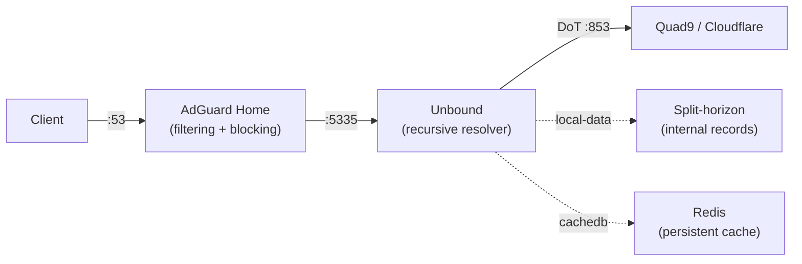

# AdGuard Home

AdGuard Home is a network-wide DNS filtering and ad-blocking server. This stack pairs it with an [Unbound](https://github.com/madnuttah/unbound-docker) recursive resolver for privacy-focused upstream DNS over TLS.

## Why

Most home networks rely on the ISP's default DNS, which offers no filtering, no encryption, and full visibility into every domain you visit. Running AdGuard Home locally gives you network-wide ad and tracker blocking without installing anything on individual devices. Pairing it with Unbound adds recursive resolution over DNS-over-TLS — your queries never leave the network in plain text, and no single upstream provider sees all of them. Finally, managing the config via GitOps means the DNS setup is reproducible, auditable, and recovers automatically after a redeploy.

## Compose File

- [compose.yaml](https://github.com/DevSecNinja/truenas-apps/blob/main/services/adguard/compose.yaml) — primary stack definition
- [compose.svlazext.yaml](https://github.com/DevSecNinja/truenas-apps/blob/main/services/adguard/compose.svlazext.yaml) — Azure DNS VM override (svlazext)

## Access

| URL                                 | Description                                |
| ----------------------------------- | ------------------------------------------ |
| `https://adguard.${DOMAINNAME}`     | Web UI (Traefik forward-auth)              |
| `https://adguard-ext.${DOMAINNAME}` | Web UI on svlazext (Azure DNS VM override) |

## Architecture

- **Images**: [adguard/adguardhome](https://github.com/AdguardTeam/AdGuardHome), [madnuttah/unbound](https://github.com/madnuttah/unbound-docker), [redis](https://hub.docker.com/_/redis) (DNS cache backend), [busybox](https://hub.docker.com/_/busybox) (init containers)
- **User/Group**: `3101:3101` (`svc-app-adguard`) — both AdGuard Home and Unbound run under this identity
- **Networks**: `adguard-frontend` (bridge, `172.30.53.0/24`) — Unbound at `.2`, AdGuard at `.3`; `adguard-backend` (internal bridge, no host exposure) — Unbound and Redis only
- **Ports**: `53/tcp` and `53/udp` published on the host for DNS resolution
- **Reverse proxy**: Traefik with `chain-auth@file` middleware; monitoring router on the internal `monitoring` entrypoint for Gatus health checks

### DNS Resolution Flow



AdGuard handles DNS filtering and ad blocking. Queries that pass the filter are forwarded to the co-located Unbound instance, which resolves them recursively over TLS against upstream providers (Quad9, Cloudflare). Internal domain names are served from Unbound's local-data records (split-horizon — see below).

### Config Management

The AdGuard Home configuration file (`config/conf/AdGuardHome.yaml`) is git-tracked and treated as the source of truth. On every deploy, `adguard-init` copies it into `data/conf/`, overwriting any changes made through the web UI. The UI should be considered read-only — any manual UI changes are lost on the next deployment.

### Config Template Substitution (Unbound)

Unbound config files contain `${VAR}` placeholders for secrets and environment-specific values (domain names, IP addresses). The `adguard-unbound-init` container runs `config/unbound/envsubst.sh` at deploy time to substitute these placeholders with values from `secret.sops.env` and writes the processed output to `data/unbound/`. Unbound then mounts the processed files read-only.

Template files and their purpose:

| Template                                      | Content                                                                         |
| --------------------------------------------- | ------------------------------------------------------------------------------- |
| `config/unbound/conf.d/a-records.conf`        | Local DNS A records for internal hosts (split-horizon)                          |
| `config/unbound/conf.d/server-overrides.conf` | Logging, private-domain, split-horizon zone, TLS cert bundle                    |
| `config/unbound/zones.d/forward-zones.conf`   | Forward zones for DDNS domain + catch-all upstream (Quad9/Cloudflare over TLS)  |
| `config/unbound/conf.d/remote-control.conf`   | Unbound remote-control settings (mounted directly, no substitution)             |
| `config/unbound/conf.d/cachedb.conf`          | `cachedb:` clause pointing to Redis backend (mounted directly, no substitution) |

The `envsubst.sh` script verifies that no unresolved `${VAR}` placeholders remain after substitution — missing variables in `secret.sops.env` cause the init container to fail loudly rather than starting Unbound with a broken config.

### Services

| Container              | Role                                                                                                                           |
| ---------------------- | ------------------------------------------------------------------------------------------------------------------------------ |
| `adguard-unbound-init` | One-shot init: substitutes `${VAR}` placeholders in Unbound config templates, chowns output to `3101:3101`                     |
| `adguard-redis`        | Ephemeral Redis cache backend for Unbound's `cachedb` module — cache survives Unbound restarts but is lost on Redis restart    |
| `adguard-unbound`      | Recursive DNS resolver (Unbound) — DNS-over-TLS to upstream, local-data for internal names                                     |
| `adguard-init`         | One-shot init: copies `AdGuardHome.yaml` from repo config into `data/conf/`, chowns `data/work` and `data/conf` to `3101:3101` |
| `adguard`              | AdGuard Home DNS filter — listens on port 53, forwards to Unbound on the frontend network                                      |

### Startup Order

```text
adguard-redis (healthy) ──────────────────────────────────────────┐
adguard-unbound-init (completed) ─────────────────────────────────┴─→ adguard-unbound (waits for both)
adguard-init (completed) ─────────────────────────────────────────────────────────────────────────────┐
                                                                       adguard-unbound (healthy) ──────┴─→ adguard
```

### Init Containers

**`adguard-unbound-init`** runs the envsubst script and chowns the output directory:

- Capabilities: `CHOWN` (transfer ownership) + `DAC_OVERRIDE` (overwrite existing output files)
- Volumes chown'd: `./data/unbound`

**`adguard-init`** seeds the AdGuard config from the git-tracked source and sets ownership on runtime directories:

- Capabilities: `CHOWN` (transfer ownership) + `DAC_OVERRIDE` (traverse previously chowned directories)
- Volumes chown'd: `./data/work`, `./data/conf`

### Unbound Exceptions

The `adguard-unbound` container deviates from the standard hardening baseline:

- **`user:` is omitted**: the entrypoint starts as root, chowns directories to `UNBOUND_UID:UNBOUND_GID`, then drops privileges to the internal `_unbound` user
- **`read_only` is omitted**: the image writes a pidfile and auth-zone data under `/usr/local/unbound/` during startup
- **`cap_add`**: `CHOWN` (entrypoint chown), `SETUID` / `SETGID` (privilege drop to `_unbound`)
- **`module-config`**: overridden to `"validator cachedb iterator"` in `server-overrides.conf` (default is `"validator iterator"`) to enable the Redis-backed `cachedb` module

### Healthcheck

Unbound's healthcheck verifies two things in sequence:

1. Resolves `healthcheck.${DOMAINNAME}` — proves Unbound is running, the config was loaded, and envsubst substituted `${DOMAINNAME}` correctly
2. Resolves `dns.quad9.net` — proves forward zones and upstream TLS are working

AdGuard's healthcheck is a simple HTTP check against its web UI on port 80.

## Multi-Server Deployment

AdGuard runs on both the TrueNAS host (svlnas) and the Azure DNS VM (svlazext). The `compose.svlazext.yaml` override adjusts Traefik labels to use the `adguard-ext.${DOMAINNAME}` hostname for the external instance.

## Secrets

Managed via `secret.sops.env` (SOPS-encrypted, decrypted to `.env` at deploy time):

- `DOMAINNAME` — base domain for all internal DNS records and Traefik routing
- `DDNS_DOMAIN` — dynamic DNS domain forwarded to Quad9/Cloudflare
- `IP_*` — host IP addresses used in Unbound A records (e.g. `IP_SVLNAS`, `IP_SVLAZEXT`, `IP_HOME`)

## First-Run Setup

1. Create the dataset `vm-pool/apps/services/adguard` in TrueNAS
2. Create a `svc-app-adguard` group (GID 3101) and user (UID 3101) on the TrueNAS host — see [Infrastructure](../INFRASTRUCTURE.md#app-service-accounts) for the full procedure
3. Add the required variables to `secret.sops.env` — at minimum `DOMAINNAME`, `DDNS_DOMAIN`, and the `IP_*` addresses referenced in the Unbound A-record template
4. Encrypt the secrets file: `sops -e -i services/adguard/secret.sops.env`
5. Deploy: the CD script decrypts secrets and brings the stack up. Verify Unbound health first (`docker logs adguard-unbound-init`), then confirm AdGuard is resolving queries on port 53
6. Point your network's DNS to the host IP running AdGuard (router DHCP settings or per-device)

## Upgrade Notes

No special upgrade procedures are required for this stack. AdGuard Home and Unbound handle schema and data migrations automatically on startup. Image updates are managed by Renovate via digest-pinning PRs.
