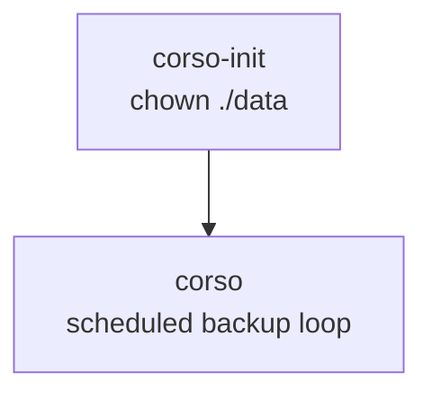

# Corso

[Corso](https://github.com/alcionai/corso) is an open-source Microsoft 365 backup CLI. This stack runs Corso as a scheduled backup runner with no web UI, no Traefik route, and no DNS record.

## Why

Microsoft 365 data still needs independent backup coverage. Corso provides a lightweight containerised runner that can back up Exchange, OneDrive, and SharePoint data to an S3-compatible repository without adding another always-on web application.

## Compose File

- [compose.yaml](https://github.com/DevSecNinja/truenas-apps/blob/main/services/corso/compose.yaml)

## Access

Corso has no browser-facing interface. Operate it through container logs and the Corso CLI inside the running container.

| Interface               | Description                          |
| ----------------------- | ------------------------------------ |
| `docker logs corso`     | Backup run start/completion messages |
| `./data/logs/corso.log` | Corso application log file           |

## Architecture

- **Images**: [ghcr.io/alcionai/corso](https://github.com/alcionai/corso), [busybox](https://hub.docker.com/_/busybox) (init container)
- **User/Group**: `3127:3127` (`svc-app-corso`)
- **Data directory**: `./data` mounted at `/app/corso`
- **Networks**: `corso-backend` bridge network for outbound backup traffic
- **Reverse proxy**: none — this is a CLI scheduled backup runner, not a web application

### Services

| Container    | Role                                                                                                    |
| ------------ | ------------------------------------------------------------------------------------------------------- |
| `corso-init` | One-shot init: creates `./data/logs` and chowns `./data` to `3127:3127`                                 |
| `corso`      | Microsoft 365 backup runner; initialises the S3 repository and loops on `CORSO_BACKUP_INTERVAL_SECONDS` |

### Startup Order



## Secrets

Managed via `secret.sops.env` (SOPS-encrypted, decrypted to `.env` at deploy time):

| Variable                        | Description                               |
| ------------------------------- | ----------------------------------------- |
| `MEM_LIMIT`                     | Optional container memory limit override  |
| `CORSO_BACKUP_INTERVAL_SECONDS` | Sleep interval between backup runs        |
| `CORSO_S3_BUCKET`               | S3 bucket used for the Corso repository   |
| `CORSO_S3_PREFIX`               | Optional S3 prefix for the repository     |
| `CORSO_S3_ENDPOINT`             | Optional S3-compatible endpoint override  |
| `CORSO_PASSPHRASE`              | Corso repository passphrase               |
| `AWS_ACCESS_KEY_ID`             | S3 access key                             |
| `AWS_SECRET_ACCESS_KEY`         | S3 secret key                             |
| `AWS_SESSION_TOKEN`             | Optional temporary S3 session token       |
| `AZURE_TENANT_ID`               | Microsoft Entra tenant ID                 |
| `AZURE_CLIENT_ID`               | Microsoft Entra application client ID     |
| `AZURE_CLIENT_SECRET`           | Microsoft Entra application client secret |
| `CORSO_EXCHANGE_MAILBOXES`      | Exchange mailbox selector                 |
| `CORSO_ONEDRIVE_USERS`          | OneDrive user selector                    |
| `CORSO_SHAREPOINT_SITES`        | SharePoint site selector                  |

## First-Run Setup

1. Create the dataset `vm-pool/apps/services/corso` in TrueNAS.
2. Create the `svc-app-corso` group (GID 3127), then user (UID 3127) on the TrueNAS host. See [Infrastructure § TrueNAS Host Setup](../../docs/INFRASTRUCTURE.md#truenas-host-setup) for the standard creation order.
3. Configure a Microsoft Entra application for Corso and store the tenant ID, client ID, and client secret in `secret.sops.env`.
4. Configure the S3 repository variables and Corso passphrase in `secret.sops.env`.
5. Encrypt the secrets file:

    ```sh
    sops -e -i services/corso/secret.sops.env
    ```

6. Deploy the stack. `corso-init` creates and chowns `./data`; `corso` initialises the repository and starts the scheduled backup loop.
7. Verify the first run with `docker logs corso` and `./data/logs/corso.log`.

## Upgrade Notes

- Corso is an archived but still-available upstream project; validate backup and restore behaviour before relying on an image update.
- Image updates are managed by Renovate via digest-pinning PRs.
- Local runtime state and logs live in `./data`; the backup repository is stored in the configured S3 bucket/prefix.
