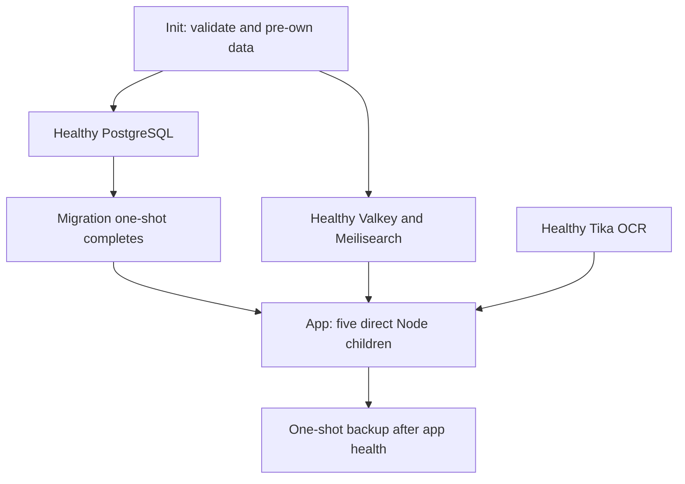

# Open Archiver

Open Archiver stores an encrypted email archive on TrueNAS, with full-text
search and Apache Tika/Tesseract OCR for attachments.

## Status

This stack is implemented in the current branch under
[issue #789](https://github.com/DevSecNinja/truenas-apps/issues/789).
**Implementation is complete; production adoption is not yet approved.**
The request to proceed with implementation does not mean vulnerabilities are
fixed or production risk has been accepted. Runtime, restore, and publication
evidence is recorded below; no TrueNAS rollout has occurred.

## Known Security Risk and Adoption Review

<!-- dprint-ignore -->
!!! danger "Published image has fixable HIGH/CRITICAL vulnerabilities"
    A live Trivy scan of the exact published digest
    `sha256:b094239f1eff4a02cc85c68a8def7d8838bd70805705c71a85bf09c6c8aee702`
    reported **199 raw fixable HIGH/CRITICAL entries**. This is not a
    deduplicated count or an exploitability assessment. Findings include CRITICAL
    `@casl/ability` `6.7.3` (fixed in `6.7.5`) and multiple SvelteKit `2.38.1`
    advisories (fixed in `2.57.1`). Do not describe this image as secure.

**Decision: dependency remediation stays upstream.** This repository will not
maintain a patched dependency lock or fork. Before deployment, the operator
must approve production adoption under the
[image-adoption policy](https://github.com/DevSecNinja/truenas-apps/blob/main/docs/ARCHITECTURE.md#image-selection-upstream-dependency-maintenance):
verify an upstream-fixed replacement artifact, or explicitly review and
document a narrowly justified risk exception. No such exception is recorded
here; successful hardening and runtime/restore tests do not substitute for it.

The proposed upstream dependency-reporting issue is **deferred as a TODO,
not filed**. Existing repository tracking remains
[issue #789](https://github.com/DevSecNinja/truenas-apps/issues/789); no
additional issue is created by this documentation.

Image-bootstrap commit `831954bc4caac4edee212c2bf07cbabca6267c35` records the
published derivative image's provenance. The integration is implemented, with
no TrueNAS deployment; production adoption awaits upstream fixes or explicit,
narrowly reviewed acceptance.
This documentation change does **not** disable Compose or authorize production
deployment.

### Evidence and Remaining Acceptance

| Item                             | Current evidence                                                                                                                                                                                                                                                                                          |
| -------------------------------- | --------------------------------------------------------------------------------------------------------------------------------------------------------------------------------------------------------------------------------------------------------------------------------------------------------- |
| App source                       | Exact upstream revision `2082eba984ca771c23c2a7c60fc9284794e24b9b`, containing the archive integrity fix                                                                                                                                                                                                  |
| Derivative build                 | Native rootless Podman build passed; runtime identity `3132:3132` loaded `sqlite3` and could read application artifacts and all migration files                                                                                                                                                           |
| Published image                  | `ghcr.io/devsecninja/truenas-apps/open-archiver:831954bc4caac4edee212c2bf07cbabca6267c35@sha256:b094239f1eff4a02cc85c68a8def7d8838bd70805705c71a85bf09c6c8aee702`; anonymously pullable and pinned in Compose                                                                                             |
| Publication checks               | [Workflow 36323007982](https://github.com/DevSecNinja/truenas-apps/actions/runs/36323007982) passed the build, 18 supervisor tests, non-root artifact test, and GHCR publication with SBOM/provenance for pushed commit `831954bc4caac4edee212c2bf07cbabca6267c35`                                        |
| Secrets                          | SOPS-native creation and encrypted-file validation completed for eight generated secrets; values are not reproduced here                                                                                                                                                                                  |
| Stack smoke                      | Exact published GHCR digest pulled anonymously; full stack recreated healthy in rootless Podman, with init and migration exiting `0`                                                                                                                                                                      |
| Runtime controls                 | App verified as `3132:3132`, `CapEff=0`, `NoNewPrivs=1`; observed `pids.current` was `68/100` for the app and `55/100` for Tika                                                                                                                                                                           |
| Filesystem and database controls | App root-filesystem write failed with `EROFS`; archive hardlink succeeded; app database role verified with `rolsuper=false`, `rolcreatedb=false`, `rolcreaterole=false`                                                                                                                                   |
| Repeat startup                   | Init succeeded repeatedly; restarting the original test stack preserved its email and search index                                                                                                                                                                                                        |
| Provisioning tests               | All 26 tests passed, including the new UID `3132` registry case; pre-existing Memos helper warnings remain                                                                                                                                                                                                |
| Application smoke                | Real upstream schema migrated; first administrator created; second setup returned `403`, unauthenticated access returned `401`; ZIP containing MIME EML and a text attachment ingested and indexed exactly one email                                                                                      |
| OCR smoke                        | A generated PNG containing `ARCHIVE OCR 1420` was recognized through the app-to-Tika isolated parser network                                                                                                                                                                                              |
| Backup                           | After queue drain and clean app exit `0`, mapped-identity backup ran one PostgreSQL and one Redis job exactly once, exiting `0`; both GPG+ZSTD dumps passed SHA1 verification                                                                                                                             |
| Backup permissions               | Verified output directory `3132:3132`, mode `0700`; fresh dump mode `0600`                                                                                                                                                                                                                                |
| Recovery                         | Synthetic PostgreSQL, copied encrypted archive, and Valkey recovery passed on rootless Podman AMD64; [exact outcomes](https://github.com/DevSecNinja/truenas-apps/blob/main/docs/BACKUP.md#open-archiver-synthetic-restore-evidence)                                                                      |
| Search rebuild                   | Emptied Meilisearch documents to `0`; `POST reindex-all` with `mode=full` rebuilt `1` document from preserved archive data; database email count remained `1`                                                                                                                                             |
| HTTPS proxy boundary             | Actual router labels and repository middleware passed real HTTPS tests with upstream Traefik `3.7.10` and only Forward Auth replaced by a synthetic responder; [exact scope and responses](https://github.com/DevSecNinja/truenas-apps/blob/main/docs/BACKUP.md#open-archiver-synthetic-restore-evidence) |
| Production gate                  | **Not approved**: known fixable HIGH/CRITICAL dependencies require an upstream-fixed artifact or explicit, narrowly reviewed operator risk acceptance; the raw scan count is not a deduplicated or exploitability assessment                                                                              |
| Further validation               | After clearing the security gate: actual Entra login, TrueNAS rollout, MFA, mailbox-provider integration, UI download acceptance, and load testing                                                                                                                                                        |

These synthetic results used no production credentials and are not host
deployment or storage-layer recovery evidence. Publication is complete;
the anonymously pulled digest passed full-stack startup. It uses the same
source, migrations, and dependent-service versions as the local tests.
The originally selected release `v0.6.0` predates the integrity fix; it is
not a recommended downgrade or fallback.

## Why

- Keep archived messages and attachments in private local storage rather than
  depending solely on the source mailbox.
- Search messages and OCR-extracted attachment text.
- Apply existing Traefik Forward Auth in front of separate local app
  authentication and MFA.

Encryption at rest is not end-to-end protection from the server:
the app must decrypt content, Meilisearch stores searchable plaintext,
and temporary imports/parser processing can expose plaintext locally.

## Compose Files

- [compose.yaml](https://github.com/DevSecNinja/truenas-apps/blob/main/services/open-archiver/compose.yaml)
- [image/Dockerfile](https://github.com/DevSecNinja/truenas-apps/blob/main/services/open-archiver/image/Dockerfile)
- [image/start.mjs](https://github.com/DevSecNinja/truenas-apps/blob/main/services/open-archiver/image/start.mjs)
- [config/init-database.sql](https://github.com/DevSecNinja/truenas-apps/blob/main/services/open-archiver/config/init-database.sql)
- [secret.sops.env](https://github.com/DevSecNinja/truenas-apps/blob/main/services/open-archiver/secret.sops.env)

These source links target the repository's default branch.

## Access

| URL                                         | Authentication                                                                     | Purpose                       |
| ------------------------------------------- | ---------------------------------------------------------------------------------- | ----------------------------- |
| `https://open-archiver.${DOMAINNAME}`       | `chain-auth@file`, then local Open Archiver authentication and MFA                 | Web UI and API                |
| `https://open-archiver.${DOMAINNAME}/setup` | Restrict Forward Auth to the intended administrator before creating the first user | First-run administrator setup |

The existing middleware uses
[ItalyPaleAle's Traefik Forward Auth](https://github.com/ItalyPaleAle/traefik-forward-auth),
not Authelia. Built-in Open Archiver SSO is not available in the OSS edition;
the forward-auth session does not replace the local account or its MFA.
No host ports are published, and there is no public, mobile, API, or monitoring
route bypass. Keep setup behind the same authenticated route.

## Architecture

### Services

All image references below are digest-pinned in the source files.

| Container                   | Image                                                                     | Role                                                                                       |
| --------------------------- | ------------------------------------------------------------------------- | ------------------------------------------------------------------------------------------ |
| `open-archiver`             | Derivative GHCR image; base `docker.io/logiclabshq/open-archiver:2082eba` | Node supervisor plus API, frontend, ingestion worker, indexing worker, and scheduler       |
| `open-archiver-db`          | `docker.io/library/postgres:17.11-alpine3.24`                             | PostgreSQL metadata, users, and encrypted mailbox credentials                              |
| `open-archiver-db-backup`   | `docker.io/nfrastack/db-backup:4.9.2`                                     | One-shot PostgreSQL and Valkey backup                                                      |
| `open-archiver-init`        | `docker.io/library/busybox:1.38.0`                                        | Validate required settings, create private runtime paths, assign ownership, and exit       |
| `open-archiver-meilisearch` | `docker.io/getmeili/meilisearch:v1.38.2`                                  | Derived full-text search index                                                             |
| `open-archiver-migrate`     | Same derivative image as the app                                          | One-shot `node /app/packages/backend/dist/database/migrate.js` after PostgreSQL is healthy |
| `open-archiver-tika`        | `docker.io/apache/tika:3.2.2.0-full`                                      | Attachment parsing and Tesseract OCR                                                       |
| `open-archiver-valkey`      | `docker.io/valkey/valkey:8.1.10-alpine3.24`                               | Authenticated Redis-protocol queue and transient MFA state                                 |



The Dockerfile uses `pnpm install --frozen-lockfile --prod` at build time,
allowing the `esbuild` and `sqlite3` native build steps. The final image uses
the dedicated app identity; runtime does not install dependencies or modify
tracked configuration. `start.mjs` launches direct Node processes rather than
package-manager wrappers. Any unexpected child exit stops the group. Migrations
are separate, so the app cannot serve before successful schema migration.

PostgreSQL reads `config/init-database.sql`, mounted read-only at
`/docker-entrypoint-initdb.d/10-open-archiver.sql`. Native psql `\getenv`
reads `OPEN_ARCHIVER_DB_PASSWORD` into the SQL variable; no shell wrapper is
used. The hook creates the `openarchiver` role with `NOSUPERUSER`,
`NOCREATEDB`, and `NOCREATEROLE`, grants ownership of the `openarchiver`
database, and revokes public database access and public schema creation.
The database container uses `${POSTGRES_ADMIN_PASSWORD}` for its administrator;
init also receives it to validate that it is populated. The app, migrations,
and backup receive only `${POSTGRES_PASSWORD}` for the app database role.
The hook runs on a fresh PostgreSQL data directory; changing its file or a
password environment value does not retroactively modify an existing role.

The PostgreSQL health check authenticates over TCP as `openarchiver` against
its database using `OPEN_ARCHIVER_DB_PASSWORD`, executes `SELECT 1`, and
requires exactly `1` in the output. This checks app-role authentication and
database access after bootstrap, rather than merely server availability via
`pg_isready`. It does not prove migrations or the full application work.

Valkey's authenticated `valkey-cli ping` health check uses
`REDISCLI_AUTH=${REDIS_PASSWORD}` and requires `PONG`.

**Image tradeoffs:**

- Upstream PostgreSQL Alpine supports `/docker-entrypoint-initdb.d`; DHI
  PostgreSQL does not process the required role-bootstrap hooks.
- DHI Valkey was found in the catalog, but an authenticated pull failed in
  the local validation environment. Upstream Alpine was selected so local
  tests and CI can use the same verifiable pinned image; this forgoes the
  hardened-image preference, not Valkey functionality.
- Tika's full variant is the explicitly selected OCR-capable image, rather
  than the smaller non-OCR variant.

### Networks

| Network                  | Members                                                  | Access                                                            |
| ------------------------ | -------------------------------------------------------- | ----------------------------------------------------------------- |
| `open-archiver-backend`  | App, migrations, PostgreSQL, Valkey, Meilisearch, backup | Internal only                                                     |
| `open-archiver-frontend` | App; Traefik joins for routing                           | HTTPS ingress through Traefik and app egress to mailbox providers |
| `open-archiver-parser`   | App and Tika only                                        | Internal parser traffic; no direct internet route                 |

Traefik forwards to the frontend on port `3000`; the API uses
`PORT_BACKEND=4000`. PostgreSQL, Valkey, Meilisearch, and Tika endpoints are
internal, not host-published. Tika receives no archive mount or application
secrets and cannot directly reach backend services. A parser compromise
can still reach its app peer; network separation is not complete containment.
See [network and access model](https://github.com/DevSecNinja/truenas-apps/blob/main/docs/ARCHITECTURE.md#open-archiver-network-and-access-model).

### Identity and Hardening

| Component/path                                           | Configured UID:GID | Mechanism                                                                             |
| -------------------------------------------------------- | ------------------ | ------------------------------------------------------------------------------------- |
| App, migrations, Meilisearch                             | `3132:3132`        | Direct `user:`; `svc-app-open-archiver`                                               |
| Backup process                                           | `3132:3132`        | Pre-init creates/verifies `archivebackup`; `DBBACKUP_USER`/`DBBACKUP_GROUP` select it |
| `./data/archive`, `./data/scratch`, `./data/meilisearch` | `3132:3132`        | Pre-owned by init                                                                     |
| `./data/postgres`                                        | `70:70`            | Pre-owned by init; direct PostgreSQL identity                                         |
| `./data/valkey`                                          | `999:1000`         | Pre-owned by init; direct Valkey identity                                             |
| Tika                                                     | `35002:35002`      | Direct parser identity; tmpfs-only writable storage                                   |

The dedicated TrueNAS account has matching primary UID/GID, no shared groups,
and `admin_group_member=false`. See [Open Archiver Identity](https://github.com/DevSecNinja/truenas-apps/blob/main/docs/INFRASTRUCTURE.md#open-archiver-identity).
Init changes only `./data`, applying `u=rwX,g=,o=`; it never chowns or writes
`./config`. Required variables reject empty/sentinel values, and both
encryption keys must be 64 hexadecimal characters encoding 32 bytes.

Every container sets `no-new-privileges`, drops all capabilities, and has
`pids_limit: 100`. Init adds only `CHOWN`, `FOWNER`, and `DAC_OVERRIDE`.
All roots are read-only **except the approved one-shot backup exception**:
nfrastack `/init` writes `/etc/bash/bashrc`, and read-only startup failed.
The backup adds only `CHOWN`, `DAC_OVERRIDE`, `FOWNER`, `SETUID`, and `SETGID`
for path setup and privilege dropping. A successful dump did not prove correct
ownership: the earlier Open Archiver configuration's `USER_DBBACKUP` and
`GROUP_DBBACKUP` were ignored, leaving output owned by the image-default
identity. The current idempotent `CONTAINER_INIT_PRE_COMMAND` uses the verified
image-provided `adduser`/`addgroup` tools to create `archivebackup` and assert
its UID and primary GID before `DBBACKUP_USER`/`DBBACKUP_GROUP` select it.
The mapped-identity synthetic run verified output directory ownership
`3132:3132` with mode `0700` and a fresh dump with mode `0600`.
It mounts only backup output, not archive/database data or the Docker socket.

### Runtime Settings

| Setting                 | Configured value                                                                                             |
| ----------------------- | ------------------------------------------------------------------------------------------------------------ |
| App memory              | `${MEM_LIMIT:-4096m}`                                                                                        |
| PostgreSQL memory       | `${DB_MEM_LIMIT:-1024m}`; shared memory `128mb`                                                              |
| Valkey memory           | `${VALKEY_MEM_LIMIT:-512m}`                                                                                  |
| Meilisearch memory      | `${MEILI_MEM_LIMIT:-1024m}`; indexing memory `512Mb`, two indexing threads                                   |
| Tika memory             | `${TIKA_MEM_LIMIT:-1536m}`; `-Xmx512m -XX:ActiveProcessorCount=2` per each of two JVMs; `OMP_THREAD_LIMIT=2` |
| Backup memory           | `${BACKUP_MEM_LIMIT:-512m}`                                                                                  |
| Init / migration memory | `64m` / `512m`                                                                                               |
| Import body limit       | `BODY_SIZE_LIMIT=100M`                                                                                       |
| Archive policy          | `ENABLE_DELETION=false`, `ALL_INCLUSIVE_ARCHIVE=false`, `ARCHIVE_DRAFTS=false`                               |
| Synchronization         | `SYNC_FREQUENCY=*/5 * * * *`                                                                                 |
| Concurrency             | Ingestion worker, ingestion email, and indexing worker concurrency each `2`                                  |
| Indexing                | Worker heap `1024` MiB; Meilisearch batch `100`, chunk `10`                                                  |
| Local storage           | `STORAGE_TYPE=local`, `STORAGE_LOCAL_ROOT_PATH=/archive`                                                     |
| Valkey persistence      | RDB `--save 300 1`; AOF enabled with `everysec`; `noeviction` policy                                         |
| Sessions                | `JWT_EXPIRES_IN=1d`                                                                                          |
| Shared environment      | All eight containers include `../shared/env/tz.env`                                                          |

These are initial limits, not validated capacity guarantees. Test representative
imports and OCR under the 100-task caps before accepting them. The app health
check requests `/api/v1/auth/status` through the local frontend; it does not
prove ingestion, indexing, MFA, or end-to-end archive integrity.

### Persistent State

| Host path             | Container path             | Classification and recovery                                                                     |
| --------------------- | -------------------------- | ----------------------------------------------------------------------------------------------- |
| `./backups/db-backup` | `/backup`                  | Encrypted database/queue dump output; 48-hour local retention                                   |
| `./data/archive`      | `/archive`                 | Critical encrypted messages/attachments; independently back up at storage layer                 |
| `./data/meilisearch`  | `/meili_data`              | Rebuildable **sensitive searchable plaintext**; full reindex after loss                         |
| `./data/postgres`     | `/var/lib/postgresql/data` | PostgreSQL database; portable recovery from DB01 dump                                           |
| `./data/scratch`      | `/tmp` in app              | Regeneratable disk-backed imports/temp files; may contain sensitive plaintext or in-flight work |
| `./data/valkey`       | `/data` in Valkey          | Persistent queue and transient MFA state; DB02 RDB backup plus storage-layer persistence        |

The SQL hook at `./config/init-database.sql` is mounted read-only. Tika uses
tmpfs scratch, not persistent archive storage. Do not delete scratch while
imports/workers are active: disable sources, drain work, and stop the app before
reviewed cleanup. Do not expose runtime paths to shared groups or SMB.

## Secrets

`secret.sops.env` is decrypted to ignored `.env` by dccd. The eight generated
values have already been created and validated through native SOPS; do not
regenerate them during deployment or recovery.

| Variable                  | Classification                                                        | Purpose                                                                   |
| ------------------------- | --------------------------------------------------------------------- | ------------------------------------------------------------------------- |
| `DB_ENC_PASSPHRASE`       | Generated, 36 random bytes encoded as hex                             | GPG backup encryption                                                     |
| `DOMAINNAME`              | Existing static value inherited from app configuration; not generated | HTTPS URL, origin, and router hostname                                    |
| `ENCRYPTION_KEY`          | Generated, 32 random bytes encoded as 64 hex characters               | Encrypt stored source credentials/application secrets                     |
| `JWT_SECRET`              | Generated, 36 random bytes encoded as hex                             | Sign local authentication tokens                                          |
| `MEILI_MASTER_KEY`        | Generated, 36 random bytes encoded as hex                             | Authenticate to Meilisearch                                               |
| `POSTGRES_ADMIN_PASSWORD` | Generated, 36 random bytes encoded as hex                             | PostgreSQL administrator only; never passed to app, migrations, or backup |
| `POSTGRES_PASSWORD`       | Generated, 36 random bytes encoded as hex                             | Nonsuperuser app database role                                            |
| `REDIS_PASSWORD`          | Generated, 36 random bytes encoded as hex                             | Valkey/Redis-protocol authentication                                      |
| `STORAGE_ENCRYPTION_KEY`  | Generated, 32 random bytes encoded as 64 hex characters               | Encrypt local archived files                                              |

Mailbox OAuth/IMAP credentials are **user-supplied through the app UI**,
not generated infrastructure secrets. Select only the provider permissions
needed for the chosen source and mailbox scope. No `ADMIN_*` or
`DISABLE_SIGNUP` environment variables are configured: create the first
administrator through `/setup` and verify setup locks afterward.

Preserve the original `ENCRYPTION_KEY` and `STORAGE_ENCRYPTION_KEY` with every
recovery plan. Replacing them is not a rotation procedure for existing
encrypted data. Store recovery access and the backup passphrase independently
of the NAS; never paste secret values into commands, logs, or issues.

## First-Run Setup

<!-- dprint-ignore -->
!!! danger "Operator production acceptance required"
    Production rollout is blocked by the image vulnerabilities in
    [Known Security Risk and Adoption Review](#known-security-risk-and-adoption-review)
    until the operator approves adoption through a verified upstream-fixed
    artifact or an explicit, documented, narrowly justified exception.
    Implementation approval alone is not risk acceptance. Do not execute the
    commands below until that production decision is recorded. Remediation
    remains upstream; do not maintain a patched dependency fork here.

Publication and synthetic runtime/recovery checks passed for the current
image, but they do not clear its dependency-security gate. No TrueNAS rollout
has been verified.

On `svlnas`, the aliases must already be sourced from
`/mnt/vm-pool/apps/scripts/aliases.sh`.

1. Pull the merged changes and decrypt secrets with the standalone app-scoped
   alias:

   ```sh
   dccd-app open-archiver
   ```

   The missing TrueNAS Custom App configuration causes an expected
   deployment skip on this first pass. Do not start with `dccd-all`:
   the frontend network must exist before Traefik joins it.
2. From the updated checkout, provision the registry-declared account, group,
   and child dataset:

   ```sh
   cd /mnt/vm-pool/apps
   sudo bash scripts/truenas-prep-app.sh open-archiver
   ```

   The helper preserves checked-out files and does not grant administrative
   app-group membership.
3. Create a **separately named TrueNAS Custom App `open-archiver`** using:

   ```yaml
   include:
       - /mnt/vm-pool/apps/services/open-archiver/compose.yaml
   services: {}
   ```

4. Run the canonical final deployment:

   ```sh
   dccd-all
   ```

   This applies the app and dependent DNS/Traefik integration through normal
   ordering, decrypts secrets, and performs the default backup freshness check.
   Confirm init and migrations exit successfully, the app and dependencies
   are healthy, and the backup exits successfully with both DB01 and DB02
   artifacts. Do not treat directory-only backup health as proof of a dump.
5. Before visiting `https://open-archiver.${DOMAINNAME}/setup`, restrict the
   existing forward-auth policy to the intended administrator and verify that
   unauthenticated requests cannot reach setup. Create the local administrator,
   enable MFA, save recovery codes securely, and confirm setup is locked.
6. Add a least-privilege mailbox source through the UI. Test a small import,
   OCR of a representative attachment, full-text search, and downloads of
   original messages/attachments. Verify that unauthorized UI/API requests
   remain gated and no host-port or alternate route bypass exists.
7. Verify actual child-dataset snapshot/replication/off-site coverage and
   complete the [coordinated recovery test](https://github.com/DevSecNinja/truenas-apps/blob/main/docs/BACKUP.md#restore-open-archiver).
   Record host evidence before describing the service or its backup as deployed
   successfully.

## Database Backup

| Property               | Configuration                                                                                       |
| ---------------------- | --------------------------------------------------------------------------------------------------- |
| Image                  | Digest-pinned `docker.io/nfrastack/db-backup:4.9.2`                                                 |
| Execution              | `backup-now`, `MODE=MANUAL`, `MANUAL_RUN_FOREVER=FALSE`; internal scheduling/notifications disabled |
| Cadence                | Intended nightly host dccd run, plus full `dccd-all` deployments; no in-container nightly timer     |
| DB01                   | PostgreSQL `openarchiver`, backed up as nonsuperuser `openarchiver`                                 |
| DB02                   | Valkey via Redis protocol, including queue and transient MFA state                                  |
| Compression / checksum | ZSTD / SHA1 sidecars                                                                                |
| Encryption             | GPG using `${DB_ENC_PASSPHRASE}`                                                                    |
| Retention              | `DEFAULT_CLEANUP_TIME=2880` minutes (48 hours)                                                      |
| Output                 | `./backups/db-backup`                                                                               |
| Normal dependency      | Healthy app, after migrations                                                                       |
| Acceptance             | Default `dccd-all` backup freshness check; verify both database artifacts                           |

Actual frequency follows the host dccd cron; the generic repository example
runs forced deployments every 15 minutes. Confirm the intended nightly
schedule rather than assuming Compose enforces it.

These dumps are **not full-archive atomic backups**. They do not include
`./data/archive`, and DB01/DB02 are separate engine recovery points.
The full child dataset also needs independently verified vm-pool snapshots,
replication, and encrypted off-site coverage.

For a coordinated checkpoint: disable sources and prevent writes, drain queues
**before** stopping the app, leave PostgreSQL/Valkey running, run the one-shot
backup with `--no-deps`, and capture matching quiesced archive/dataset state.
The upstream worker can force-exit after five seconds; the supervisor's
20-second deadline and Compose's 30-second grace period do not guarantee drain.

Follow [Restore Open Archiver](https://github.com/DevSecNinja/truenas-apps/blob/main/docs/BACKUP.md#restore-open-archiver) for the exact
operator-only backup invocation and recovery sequence: restore a fresh owned
database and matching archive with original keys, recover only matching queue
state or deliberately reset/reconcile it, and fully reindex after Meilisearch
loss. Synthetic PostgreSQL, copied encrypted archive, and Valkey recovery
**passed on rootless Podman AMD64**, including both dump checksums and the
corrected backup permissions. See the
[exact synthetic outcomes and remaining checks](https://github.com/DevSecNinja/truenas-apps/blob/main/docs/BACKUP.md#open-archiver-synthetic-restore-evidence).
No production credentials were used; target-host deployment and storage-layer
recovery remain unverified.

## Upgrade Notes

- **Known security risk:** the current published digest has fixable HIGH/CRITICAL
  dependencies. Prefer verified upstream fixes; production adoption otherwise
  requires an explicit, narrowly reviewed operator exception. Do not
  maintain downstream patched dependency locks or forks. Completing the
  implementation or passing runtime/restore tests does not waive this review.
- Keep the base revision, derivative build, and published Compose digest
  coordinated; confirm publication and acceptance of each new digest.
  The fixed revision is `2082eba984ca771c23c2a7c60fc9284794e24b9b`; `v0.6.0`
  predates the archive integrity fix and is not a safe rollback recommendation.
- Before upgrades, create and verify a
  [coordinated checkpoint](https://github.com/DevSecNinja/truenas-apps/blob/main/docs/BACKUP.md#coordinated-open-archiver-checkpoint),
  preserving the current image identifiers and original encryption keys.
- Review schema and dependency changes; let the separate migration one-shot
  finish before serving traffic. Image rollback alone does not undo migrations.
- Retest direct-process startup, native `sqlite3` loading, resource limits,
  OCR/import/search/download, authentication/MFA, and backup/restore against
  the exact published image. A successful build is not runtime acceptance.
- Review PostgreSQL major-version and Meilisearch upgrade requirements
  separately. See [Database Upgrades](../DATABASE-UPGRADES.md).
  Changing a PostgreSQL environment password does not rotate an existing role.
